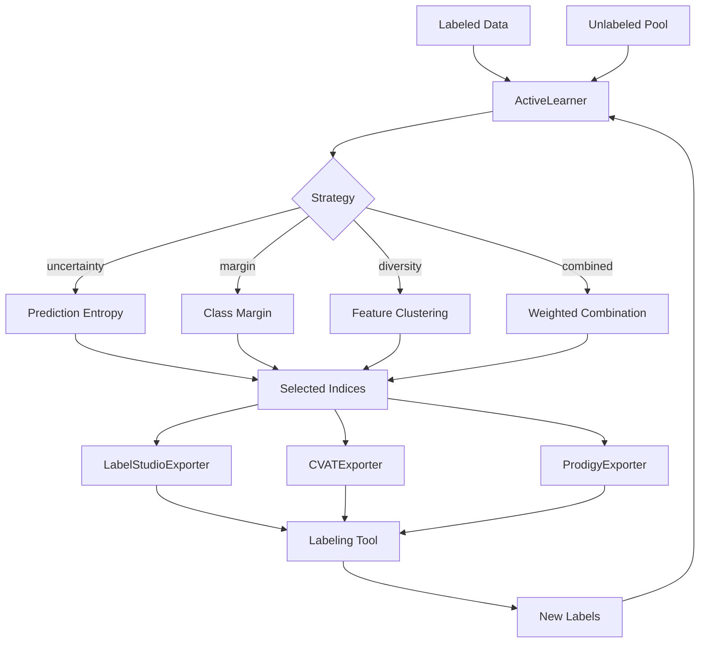

# Active Learning Integration

Intelligently select samples for labeling and export to annotation tools.

## Overview

Active learning reduces labeling costs by selecting the most informative samples for human annotation. Clean identifies uncertain or diverse samples and exports them to popular labeling tools.

## ActiveLearner

Selects samples for labeling using various strategies.

::: clean.active_learning.ActiveLearner
    options:
      show_root_heading: true
      show_source: false
      members:
        - __init__
        - fit
        - select
        - update

### Example

```python
from clean import ActiveLearner

# Initialize with sampling strategy
learner = ActiveLearner(
    strategy="uncertainty",  # uncertainty, margin, entropy, diversity, combined
    n_initial=100,
)

# Fit on labeled data
learner.fit(X_labeled, y_labeled)

# Select samples for labeling
indices = learner.select(X_unlabeled, n_samples=50)
print(f"Selected {len(indices)} samples for labeling")

# After labeling, update the model
learner.update(X_new_labeled, y_new_labeled)
```

## Sampling Strategies

| Strategy | Description | Best For |
|----------|-------------|----------|
| `uncertainty` | Samples with highest prediction uncertainty | General use |
| `margin` | Samples with smallest margin between top classes | Multi-class |
| `entropy` | Samples with highest prediction entropy | Probabilistic models |
| `diversity` | Samples that maximize coverage | Avoiding redundancy |
| `combined` | Weighted combination of strategies | Balanced selection |

### Strategy Examples

```python
# Uncertainty sampling - most uncertain predictions
learner = ActiveLearner(strategy="uncertainty")

# Margin sampling - smallest difference between top 2 predictions
learner = ActiveLearner(strategy="margin")

# Combined strategy with custom weights
learner = ActiveLearner(
    strategy="combined",
    weights={"uncertainty": 0.5, "diversity": 0.5}
)
```

## Exporters

### LabelStudioExporter

Export to [Label Studio](https://labelstud.io/) format.

```python
from clean import LabelStudioExporter

exporter = LabelStudioExporter(
    project_name="Data Quality Review",
)

# Export selected samples
exporter.export(
    data=X_unlabeled[indices],
    output_path="label_studio_tasks.json",
    metadata={"source": "active_learning_batch_1"},
)
```

### CVATExporter

Export to [CVAT](https://cvat.ai/) format for image annotation.

```python
from clean import CVATExporter

exporter = CVATExporter(
    task_name="Image Classification",
    labels=["cat", "dog", "bird"],
)

exporter.export(
    images=image_paths[indices],
    output_path="cvat_tasks.xml",
)
```

### ProdigyExporter

Export to [Prodigy](https://prodi.gy/) JSONL format.

```python
from clean import ProdigyExporter

exporter = ProdigyExporter()

exporter.export(
    data=df.iloc[indices],
    text_column="text",
    output_path="prodigy_tasks.jsonl",
)
```

## Convenience Function

### select_for_labeling

```python
from clean import select_for_labeling

indices, scores = select_for_labeling(
    X_labeled=X_train,
    y_labeled=y_train,
    X_unlabeled=X_pool,
    n_samples=100,
    strategy="uncertainty",
    return_scores=True,
)

print(f"Top sample uncertainty: {scores[0]:.3f}")
```

## Active Learning Loop

```python
from clean import ActiveLearner, LabelStudioExporter

# Initialize
learner = ActiveLearner(strategy="combined")
exporter = LabelStudioExporter()

# Initial training
learner.fit(X_initial, y_initial)

for iteration in range(10):
    # Select samples
    indices = learner.select(X_pool, n_samples=50)
    
    # Export for labeling
    exporter.export(
        X_pool[indices], 
        f"batch_{iteration}.json"
    )
    
    # ... humans label the data ...
    
    # Load new labels and update
    new_labels = load_labels(f"batch_{iteration}_labeled.json")
    learner.update(X_pool[indices], new_labels)
    
    # Remove labeled samples from pool
    X_pool = np.delete(X_pool, indices, axis=0)
    
    # Evaluate and check stopping criteria
    score = evaluate_model(learner.model, X_test, y_test)
    if score > 0.95:
        break
```

## Architecture



## Best Practices

1. **Start with uncertainty**: Most effective for initial iterations
2. **Add diversity**: Prevents selecting redundant samples
3. **Batch wisely**: 50-100 samples per batch balances efficiency and model updates
4. **Track metrics**: Monitor model improvement per labeling batch
5. **Set stopping criteria**: Define when labeling effort should stop
