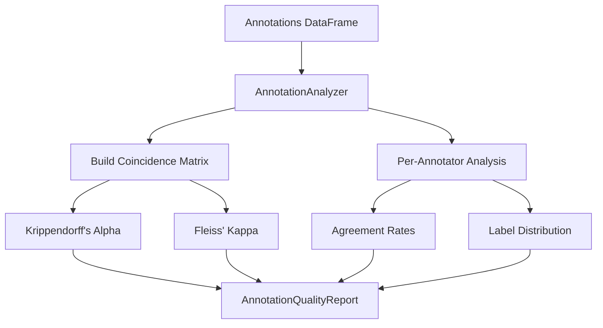

# Annotation Quality Analysis

Measure inter-annotator agreement and identify annotation quality issues.

## Overview

When multiple annotators label data, disagreements reveal both difficult samples and annotator reliability issues. Clean provides comprehensive agreement metrics and per-annotator analysis.

## AnnotationAnalyzer

Analyzes annotation quality across multiple annotators.

::: clean.annotation.AnnotationAnalyzer
    options:
      show_root_heading: true
      show_source: false
      members:
        - __init__
        - analyze
        - get_disagreements

### Example

```python
from clean import AnnotationAnalyzer

# Data with multiple annotators
# | sample_id | annotator | label |
# |-----------|-----------|-------|
# | 1         | alice     | cat   |
# | 1         | bob       | cat   |
# | 1         | carol     | dog   |
# | 2         | alice     | dog   |
# | ...       | ...       | ...   |

analyzer = AnnotationAnalyzer()
report = analyzer.analyze(
    annotations_df,
    sample_column="sample_id",
    annotator_column="annotator",
    label_column="label",
)

print(f"Overall Agreement (Krippendorff's α): {report.overall_agreement:.3f}")
print(f"Fleiss' Kappa: {report.fleiss_kappa:.3f}")

# Interpretation
if report.overall_agreement >= 0.8:
    print("✓ Excellent agreement")
elif report.overall_agreement >= 0.67:
    print("⚠ Acceptable agreement")
else:
    print("✗ Poor agreement - review annotation guidelines")
```

## AnnotationQualityReport

Results from annotation analysis.

::: clean.annotation.AnnotationQualityReport
    options:
      show_root_heading: true
      show_source: false
      members:
        - summary
        - to_dict
        - get_problem_samples

### Per-Annotator Metrics

```python
for annotator, metrics in report.per_annotator_metrics.items():
    print(f"\n{annotator}:")
    print(f"  Agreement with majority: {metrics['agreement']:.2%}")
    print(f"  Samples annotated: {metrics['n_samples']}")
    print(f"  Unique labels used: {metrics['n_unique_labels']}")
```

### Finding Disagreements

```python
# Get samples with highest disagreement
disagreements = report.get_disagreements(threshold=0.5)

for sample_id, info in disagreements.items():
    print(f"Sample {sample_id}: {info['labels']} (entropy: {info['entropy']:.2f})")
```

## Convenience Function

### analyze_annotations

```python
from clean import analyze_annotations

report = analyze_annotations(
    annotations_df,
    sample_column="sample_id",
    annotator_column="annotator", 
    label_column="label",
)
```

## Agreement Metrics

| Metric | Range | Description |
|--------|-------|-------------|
| Krippendorff's α | -1 to 1 | Handles missing data, any number of annotators |
| Fleiss' Kappa | -1 to 1 | Multiple annotators, all items rated by all |
| Cohen's Kappa | -1 to 1 | Two annotators only |

### Interpretation Guide

| Score | Interpretation |
|-------|----------------|
| ≥ 0.80 | Almost perfect agreement |
| 0.60 - 0.79 | Substantial agreement |
| 0.40 - 0.59 | Moderate agreement |
| 0.20 - 0.39 | Fair agreement |
| < 0.20 | Slight/poor agreement |

## Architecture


