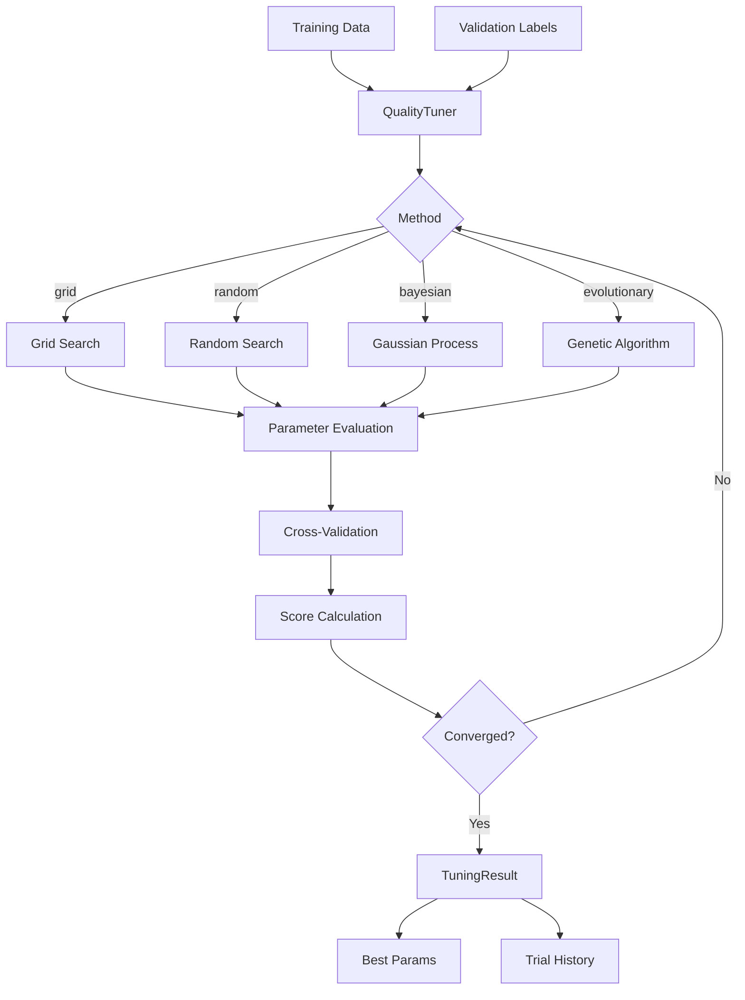

# AutoML Quality Tuning

Automatically optimize quality detection thresholds for your specific dataset.

## Overview

The AutoML module uses optimization algorithms to find the best threshold parameters for each quality detector. Instead of manually tuning confidence thresholds, let the system find optimal values based on your validation data.

## QualityTuner

Main class for automated threshold optimization.

::: clean.automl.QualityTuner
    options:
      show_root_heading: true
      show_source: false
      members:
        - __init__
        - tune
        - get_best_params
        - get_tuning_history

### Example

```python
from clean.automl import QualityTuner, TuningConfig

# Configure tuning
config = TuningConfig(
    method="bayesian",      # grid, random, bayesian, evolutionary
    n_trials=100,
    metric="f1",            # f1, precision, recall, balanced_accuracy
    cv_folds=5,
)

# Initialize tuner
tuner = QualityTuner(config=config)

# Run optimization
result = tuner.tune(
    X=features,
    y=labels,
    validation_labels=ground_truth,  # Known quality issues
)

print(f"Best score: {result.best_score:.3f}")
print(f"Best params: {result.best_params}")

# Apply optimized thresholds
from clean import DatasetCleaner
cleaner = DatasetCleaner(data=df, **result.best_params)
```

## Configuration

### TuningConfig

::: clean.automl.TuningConfig
    options:
      show_root_heading: true
      show_source: false

| Parameter | Type | Default | Description |
|-----------|------|---------|-------------|
| `method` | str | "bayesian" | Optimization method |
| `n_trials` | int | 50 | Number of parameter combinations to try |
| `metric` | str | "f1" | Optimization metric |
| `cv_folds` | int | 5 | Cross-validation folds |
| `timeout` | float | None | Max seconds for tuning |
| `n_jobs` | int | -1 | Parallel jobs (-1 = all cores) |
| `verbose` | bool | True | Show progress |

## Optimization Methods

### Grid Search

Exhaustive search over parameter grid.

```python
config = TuningConfig(
    method="grid",
    param_grid={
        "label_error_threshold": [0.8, 0.85, 0.9, 0.95],
        "outlier_threshold": [2.0, 2.5, 3.0],
        "duplicate_threshold": [0.9, 0.95, 0.99],
    }
)
```

### Random Search

Random sampling from parameter distributions.

```python
config = TuningConfig(
    method="random",
    n_trials=100,
    param_distributions={
        "label_error_threshold": ("uniform", 0.7, 0.99),
        "outlier_threshold": ("uniform", 1.5, 4.0),
    }
)
```

### Bayesian Optimization

Uses Gaussian Process to model the objective function.

```python
config = TuningConfig(
    method="bayesian",
    n_trials=50,
    acquisition_function="ei",  # ei, ucb, pi
)
```

### Evolutionary Algorithm

Genetic algorithm for complex search spaces.

```python
config = TuningConfig(
    method="evolutionary",
    n_trials=100,
    population_size=20,
    mutation_rate=0.1,
)
```

## ThresholdParams

Tunable parameters for quality detection.

::: clean.automl.ThresholdParams
    options:
      show_root_heading: true
      show_source: false

| Parameter | Range | Description |
|-----------|-------|-------------|
| `label_error_threshold` | 0.5-1.0 | Confidence for label error detection |
| `outlier_threshold` | 1.0-5.0 | Standard deviations for outliers |
| `duplicate_threshold` | 0.8-1.0 | Similarity threshold for duplicates |
| `imbalance_threshold` | 1.5-20.0 | Class ratio threshold |
| `bias_threshold` | 0.0-0.5 | Demographic parity tolerance |

## TuningResult

::: clean.automl.TuningResult
    options:
      show_root_heading: true
      show_source: false

```python
result = tuner.tune(X, y, validation_labels)

# Access results
print(result.best_score)          # 0.923
print(result.best_params)         # {'label_error_threshold': 0.87, ...}
print(result.n_trials)            # 50
print(result.optimization_time)   # 142.5 seconds

# View all trials
for trial in result.trials:
    print(f"Trial {trial.number}: score={trial.score:.3f}")
```

## Convenience Function

### tune_quality_thresholds

```python
from clean.automl import tune_quality_thresholds

best_params = tune_quality_thresholds(
    X=features,
    y=labels,
    validation_labels=ground_truth,
    method="bayesian",
    n_trials=50,
)
```

## Architecture



## Best Practices

1. **Start with Bayesian**: Most efficient for 20-100 trials
2. **Use validation data**: Labeled examples of known issues improve tuning
3. **Balance metrics**: F1 is usually best; use precision if false positives are costly
4. **Monitor convergence**: Check `result.trials` for score progression
5. **Save results**: Persist `best_params` for production use

```python
import json

# Save optimized params
with open("quality_params.json", "w") as f:
    json.dump(result.best_params, f)

# Load in production
with open("quality_params.json") as f:
    params = json.load(f)
    
cleaner = DatasetCleaner(data=df, **params)
```
