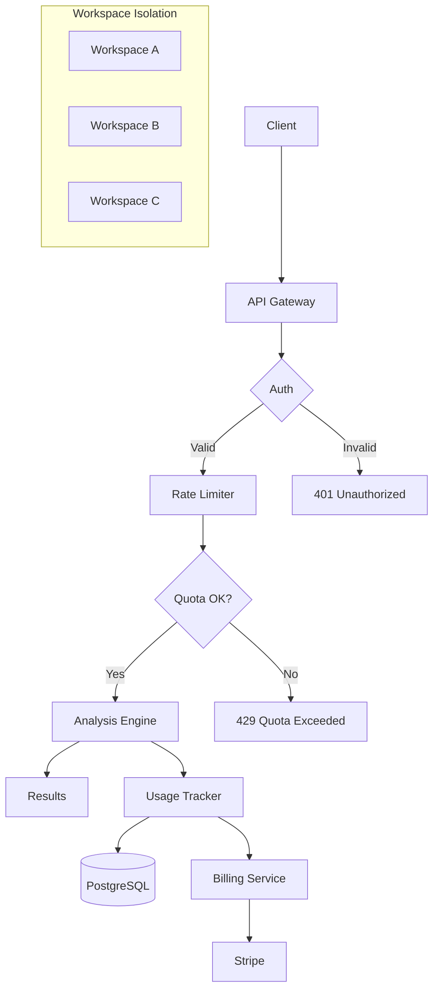

# Multi-Tenant Cloud Service

Deploy Clean as a multi-tenant SaaS platform with RBAC, workspaces, and billing.

## Overview

The cloud module provides infrastructure for running Clean as a hosted service. It includes user authentication, workspace isolation, API key management, usage tracking, and billing integration.

## CloudService

Main service orchestrator.

::: clean.cloud.CloudService
    options:
      show_root_heading: true
      show_source: false
      members:
        - __init__
        - create_workspace
        - create_user
        - create_api_key
        - analyze
        - get_usage

### Example

```python
from clean.cloud import CloudService, CloudConfig

# Initialize service
config = CloudConfig(
    database_url="postgresql://...",
    redis_url="redis://localhost:6379",
    stripe_api_key="sk_...",
)

service = CloudService(config=config)

# Create workspace
workspace = service.create_workspace(
    name="Acme Corp",
    plan="professional",
    owner_email="admin@acme.com",
)

# Create user
user = service.create_user(
    email="user@acme.com",
    workspace_id=workspace.id,
    role="analyst",
)

# Generate API key
api_key = service.create_api_key(
    user_id=user.id,
    name="Production Key",
    scopes=["analyze", "fix"],
)

print(f"API Key: {api_key.key}")
```

## Authentication

### User Management

::: clean.cloud.CloudService
    options:
      show_root_heading: true
      show_source: false
      members:
        - create_user
        - authenticate
        - get_user

```python
from clean.cloud import CloudService, Role

service = CloudService()

# Create user with role
user = service.create_user(
    email="analyst@company.com",
    password_hash="hashed_password",
    role=Role.ANALYST,
)

# Authenticate
token = service.authenticate(email="analyst@company.com", password="secure_password")

# Get user by ID
user = service.get_user(user.id)
```

### API Keys

::: clean.cloud.APIKey
    options:
      show_root_heading: true
      show_source: false

```python
from clean.cloud import CloudService

service = CloudService()

# Create API key for a user
api_key = service.create_api_key(
    user_id=user.id,
    name="CI/CD Pipeline",
    scopes=["analyze", "read"],
)

# Validate key
validated_key = service.validate_api_key(api_key.key)
```

## Workspaces

### Workspace

Isolated tenant environment.

::: clean.cloud.Workspace
    options:
      show_root_heading: true
      show_source: false

```python
from clean.cloud import WorkspaceManager

ws_manager = WorkspaceManager(service)

# Create workspace
workspace = ws_manager.create(
    name="ML Team",
    plan="enterprise",
    settings={
        "max_users": 50,
        "max_datasets": 1000,
        "retention_days": 365,
    }
)

# Get workspace usage
usage = ws_manager.get_usage(workspace.id)
print(f"Datasets: {usage.datasets_count}")
print(f"API calls: {usage.api_calls_count}")
```

## RBAC (Role-Based Access Control)

### Roles

| Role | Permissions |
|------|-------------|
| `owner` | Full access, billing, user management |
| `admin` | User management, all analysis features |
| `analyst` | Run analysis, view reports |
| `viewer` | View reports only |

### Permission Checking

```python
from clean.cloud import check_permission, Permission

# Check if user can perform action
if check_permission(user, Permission.ANALYZE):
    result = service.analyze(data, workspace_id=user.workspace_id)
else:
    raise PermissionError("Insufficient permissions")
```

## Billing Integration

### Usage Recording

The CloudService provides usage tracking capabilities:

```python
from clean.cloud import CloudService

service = CloudService()

# Usage is automatically tracked when running analyses
# Access usage records through the service
```

### Plans and Quotas

```python
from clean.cloud import Plan, QuotaManager

# Define plans
FREE_PLAN = Plan(
    name="free",
    max_rows_per_month=10000,
    max_api_calls_per_day=100,
    max_users=1,
    features=["basic_analysis"],
)

PROFESSIONAL_PLAN = Plan(
    name="professional",
    max_rows_per_month=1000000,
    max_api_calls_per_day=10000,
    max_users=10,
    features=["all"],
    price_per_month=99.0,
)

# Check quotas
quota_manager = QuotaManager(service)
if quota_manager.check_quota(workspace.id, "rows", count=5000):
    # Proceed with analysis
    pass
else:
    raise QuotaExceededError("Monthly row limit reached")
```

## FastAPI Integration

### REST API Endpoints

```python
from clean.cloud import create_cloud_app

app = create_cloud_app(service)

# Endpoints:
# POST /api/v1/auth/login
# POST /api/v1/auth/register
# GET  /api/v1/workspaces
# POST /api/v1/analyze
# GET  /api/v1/usage
```

### Running the Server

```bash
# Start cloud service
clean cloud serve --port 8000 --workers 4

# Or with uvicorn
uvicorn clean.cloud:app --host 0.0.0.0 --port 8000
```

## Configuration

Configuration is handled through the CloudService initialization and environment variables:

| Parameter | Required | Description |
|-----------|----------|-------------|
| `storage_path` | No | Path for local storage backend |
| Environment vars | No | Configure through environment |

## Architecture



## Deployment

### Docker

```dockerfile
FROM python:3.10-slim
WORKDIR /app
COPY . .
RUN pip install clean-data-quality[cloud,api]
CMD ["clean", "cloud", "serve", "--port", "8000"]
```

### Kubernetes

```yaml
apiVersion: apps/v1
kind: Deployment
metadata:
  name: clean-cloud
spec:
  replicas: 3
  template:
    spec:
      containers:
      - name: clean
        image: clean-data-quality:latest
        ports:
        - containerPort: 8000
        env:
        - name: DATABASE_URL
          valueFrom:
            secretKeyRef:
              name: clean-secrets
              key: database-url
```
