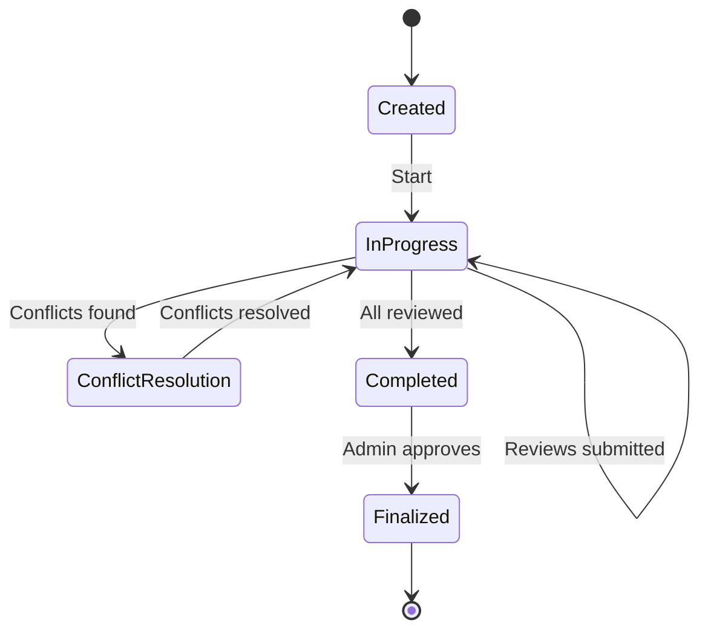
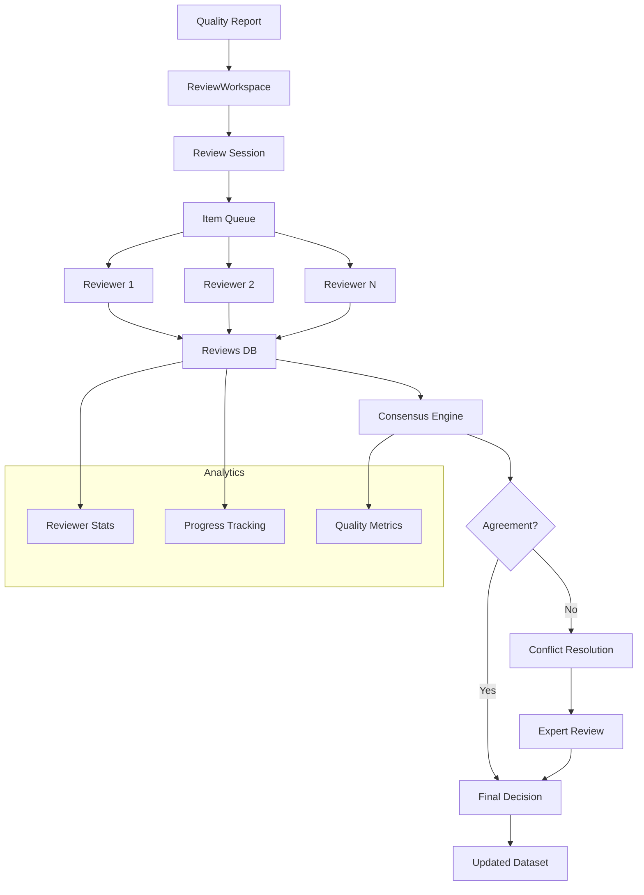

# Collaborative Review Workspace

Multi-user annotation review with voting, conflict resolution, and consensus tracking.

## Overview

The collaboration module enables teams to review data quality issues together. Multiple reviewers can vote on flagged samples, resolve conflicts, and track consensus—essential for high-stakes labeling projects.

## ReviewWorkspace

Main class for collaborative review sessions.

::: clean.collaboration.ReviewWorkspace
    options:
      show_root_heading: true
      show_source: false
      members:
        - __init__
        - create_session
        - add_reviewer
        - submit_review
        - get_consensus
        - resolve_conflicts

### Example

```python
from clean.collaboration import ReviewWorkspace

# Initialize workspace
workspace = ReviewWorkspace(
    storage_backend="postgresql",  # sqlite, postgresql, mongodb
    connection_string="postgresql://...",
)

# Create review session
session = workspace.create_session(
    name="Q4 Training Data Review",
    data=df,
    quality_report=report,
    reviewers=["alice@company.com", "bob@company.com", "carol@company.com"],
)

# Add samples for review
session.add_items(
    indices=report.label_errors().index[:100],
    issue_type="label_error",
    priority="high",
)

print(f"Session created: {session.id}")
print(f"Items to review: {session.pending_count}")
```

## Review Workflow

### Submitting Reviews

```python
# Reviewer submits their assessment
session.submit_review(
    reviewer="alice@company.com",
    item_id=42,
    decision="relabel",  # keep, relabel, remove, uncertain
    new_label="cat",
    confidence=0.9,
    notes="Clearly a cat, not a dog",
)

# Batch review
session.submit_reviews(
    reviewer="bob@company.com",
    reviews=[
        {"item_id": 42, "decision": "relabel", "new_label": "cat"},
        {"item_id": 43, "decision": "keep"},
        {"item_id": 44, "decision": "remove"},
    ]
)
```

### Review Decisions

| Decision | Description |
|----------|-------------|
| `keep` | Original label is correct |
| `relabel` | Change to different label |
| `remove` | Remove sample from dataset |
| `uncertain` | Cannot determine, needs expert |
| `skip` | Reviewer cannot assess |

## Consensus Building

### Voting Strategies

```python
from clean.collaboration import VotingStrategy

# Majority voting (default)
consensus = session.get_consensus(
    strategy=VotingStrategy.MAJORITY,
    min_votes=2,
)

# Unanimous agreement required
consensus = session.get_consensus(
    strategy=VotingStrategy.UNANIMOUS,
)

# Weighted by reviewer expertise
consensus = session.get_consensus(
    strategy=VotingStrategy.WEIGHTED,
    weights={"alice": 1.0, "bob": 0.8, "carol": 0.9},
)

# Dawid-Skene model (accounts for annotator quality)
consensus = session.get_consensus(
    strategy=VotingStrategy.DAWID_SKENE,
)
```

### Consensus Results

```python
for item_id, result in consensus.items():
    print(f"Item {item_id}:")
    print(f"  Decision: {result.decision}")
    print(f"  Agreement: {result.agreement_score:.1%}")
    print(f"  Votes: {result.vote_counts}")
    if result.has_conflict:
        print(f"  ⚠️ Conflict detected")
```

## Conflict Resolution

### Identifying Conflicts

```python
conflicts = session.get_conflicts(
    min_disagreement=0.5,  # At least 50% disagree
)

for conflict in conflicts:
    print(f"Item {conflict.item_id}: {conflict.description}")
    for reviewer, vote in conflict.votes.items():
        print(f"  {reviewer}: {vote.decision}")
```

### Resolving Conflicts

```python
# Escalate to expert
session.escalate(
    item_ids=[42, 43],
    expert="domain_expert@company.com",
    reason="Ambiguous edge case",
)

# Admin override
session.resolve_conflict(
    item_id=42,
    resolver="admin@company.com",
    final_decision="relabel",
    final_label="cat",
    resolution_note="Expert confirmed this is a cat",
)
```

## Reviewer Management

### Adding Reviewers

```python
# Add single reviewer
session.add_reviewer(
    email="dave@company.com",
    role="reviewer",  # admin, reviewer, expert
    assignments=50,  # Items to assign
)

# Assign specific items
session.assign_items(
    reviewer="dave@company.com",
    item_ids=[100, 101, 102, 103, 104],
)
```

### Reviewer Analytics

```python
from clean.collaboration import ReviewerAnalytics

analytics = ReviewerAnalytics(session)

# Per-reviewer stats
for reviewer in session.reviewers:
    stats = analytics.get_reviewer_stats(reviewer)
    print(f"{reviewer}:")
    print(f"  Completed: {stats.completed}/{stats.assigned}")
    print(f"  Agreement with consensus: {stats.consensus_agreement:.1%}")
    print(f"  Avg. confidence: {stats.avg_confidence:.2f}")
    print(f"  Speed: {stats.avg_time_per_item:.1f}s/item")
```

## Session Management

### Session States



### Session Operations

```python
# Start review session
session.start()

# Pause (no new reviews accepted)
session.pause()

# Resume
session.resume()

# Complete and finalize
if session.is_complete:
    final_result = session.finalize()
    
    # Apply decisions to dataset
    clean_df = final_result.apply_to_dataframe(df)
    print(f"Relabeled: {final_result.relabeled_count}")
    print(f"Removed: {final_result.removed_count}")
```

## Export and Reports

### Export Reviewed Data

```python
# Export with review metadata
session.export(
    output_path="reviewed_data.csv",
    include_metadata=True,
)

# Export review decisions only
decisions = session.export_decisions(format="json")
```

### Generate Reports

```python
# Session summary report
report = session.generate_report()
print(report.summary())

# Export as HTML
report.to_html("review_report.html")

# Export for compliance
report.to_audit_format("audit_trail.json")
```

## Real-Time Collaboration

### WebSocket Updates

```python
from clean.collaboration import ReviewServer

# Start collaboration server
server = ReviewServer(workspace)
server.run(host="0.0.0.0", port=8080)

# Clients connect via WebSocket for real-time updates
# ws://localhost:8080/session/{session_id}
```

### Notifications

```python
# Configure notifications
session.configure_notifications(
    on_conflict=["admin@company.com"],
    on_complete=["pm@company.com"],
    slack_webhook="https://hooks.slack.com/...",
)
```

## Architecture



## Convenience Functions

### create_review_session

```python
from clean.collaboration import create_review_session

session = create_review_session(
    data=df,
    quality_report=report,
    issue_types=["label_errors", "outliers"],
    reviewers=["alice@co.com", "bob@co.com"],
    min_reviews_per_item=2,
)
```

## Best Practices

1. **Set minimum reviewers**: At least 2-3 for consensus validity
2. **Use weighted voting**: Account for reviewer expertise levels
3. **Monitor agreement**: Low agreement may indicate unclear guidelines
4. **Resolve conflicts promptly**: Don't let them accumulate
5. **Track reviewer quality**: Use inter-annotator agreement metrics
6. **Export audit trails**: Required for compliance and reproducibility
