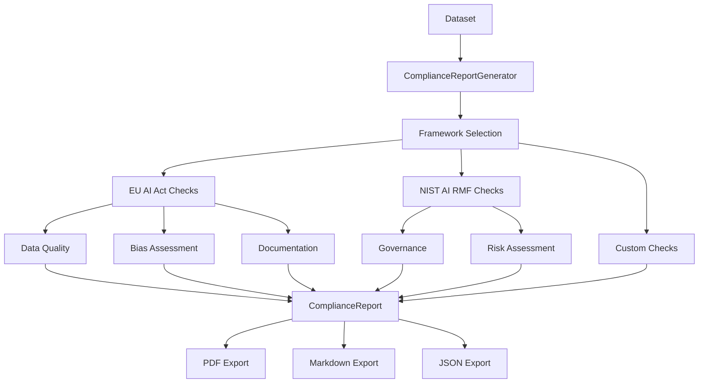

# Compliance Report Generator

Generate regulatory compliance documentation for AI/ML datasets.

## Overview

AI regulations like the EU AI Act and NIST AI RMF require documentation of data quality practices. Clean automates compliance reporting by analyzing your data and generating required documentation.

## ComplianceReportGenerator

Generates compliance reports for various regulatory frameworks.

::: clean.compliance.ComplianceReportGenerator
    options:
      show_root_heading: true
      show_source: false
      members:
        - __init__
        - generate
        - check_requirement

### Example

```python
from clean import ComplianceReportGenerator, ComplianceFramework

generator = ComplianceReportGenerator(
    frameworks=[
        ComplianceFramework.EU_AI_ACT,
        ComplianceFramework.NIST_AI_RMF,
    ]
)

report = generator.generate(
    df,
    label_column="label",
    metadata={
        "dataset_name": "Customer Churn Dataset",
        "version": "1.2.0",
        "owner": "ML Team",
    }
)

print(report.summary())

# Check specific requirement
req = report.check_requirement("data_quality_documentation")
print(f"Requirement met: {req.status}")
```

## ComplianceReport

Results from compliance analysis.

::: clean.compliance.ComplianceReport
    options:
      show_root_heading: true
      show_source: false
      members:
        - summary
        - to_dict
        - export_pdf
        - export_markdown

### Export Formats

```python
# Export as PDF
report.export_pdf("compliance_report.pdf")

# Export as Markdown
report.export_markdown("compliance_report.md")

# Export as JSON
import json
with open("compliance_report.json", "w") as f:
    json.dump(report.to_dict(), f, indent=2)
```

## Convenience Function

### generate_compliance_report

```python
from clean import generate_compliance_report, ComplianceFramework

report = generate_compliance_report(
    df,
    label_column="label",
    frameworks=[ComplianceFramework.EU_AI_ACT],
)
```

## Supported Frameworks

### EU AI Act

```python
from clean import ComplianceFramework

# EU AI Act requirements checked:
# - Data quality documentation
# - Bias assessment
# - Training data provenance
# - Error analysis
# - Human oversight provisions

report = generate_compliance_report(
    df,
    frameworks=[ComplianceFramework.EU_AI_ACT],
)

for req in report.requirements:
    if req.framework == ComplianceFramework.EU_AI_ACT:
        print(f"{req.name}: {req.status.value}")
```

### NIST AI RMF

```python
# NIST AI Risk Management Framework requirements:
# - Data governance
# - Bias and fairness testing
# - Performance metrics documentation
# - Risk assessment

report = generate_compliance_report(
    df,
    frameworks=[ComplianceFramework.NIST_AI_RMF],
)
```

### Custom Frameworks

```python
from clean.compliance import ComplianceRequirement, RiskLevel

# Define custom requirements
custom_requirements = [
    ComplianceRequirement(
        id="custom_001",
        name="Minimum Sample Size",
        description="Dataset must have at least 10,000 samples",
        risk_level=RiskLevel.HIGH,
        check_function=lambda df, **kw: len(df) >= 10000,
    ),
    ComplianceRequirement(
        id="custom_002", 
        name="No Missing Labels",
        description="All samples must have labels",
        risk_level=RiskLevel.CRITICAL,
        check_function=lambda df, label_column, **kw: df[label_column].notna().all(),
    ),
]

generator = ComplianceReportGenerator(
    custom_requirements=custom_requirements,
)
```

## Compliance Status

```python
from clean.compliance import ComplianceStatus

# Possible statuses
ComplianceStatus.COMPLIANT      # ✓ Requirement met
ComplianceStatus.NON_COMPLIANT  # ✗ Requirement not met
ComplianceStatus.PARTIAL        # ⚠ Partially met
ComplianceStatus.NOT_APPLICABLE # - Not applicable
ComplianceStatus.NEEDS_REVIEW   # ? Manual review needed
```

## Risk Levels

```python
from clean.compliance import RiskLevel

RiskLevel.LOW       # Informational
RiskLevel.MEDIUM    # Should address
RiskLevel.HIGH      # Must address
RiskLevel.CRITICAL  # Blocking issue
```

## Report Structure



## Best Practices

1. **Run regularly**: Generate reports with each data version
2. **Archive reports**: Keep historical compliance records
3. **Address gaps**: Use non-compliant findings to prioritize fixes
4. **Customize thresholds**: Adjust requirements to your risk tolerance
5. **Document exceptions**: Record justified deviations from requirements
