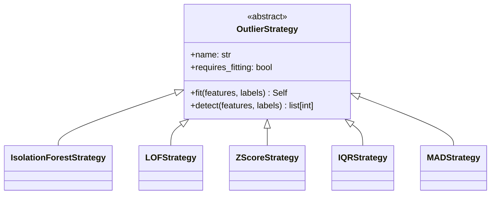

# Detection Strategies API Reference

The `clean.detection.strategies` module provides pluggable outlier detection algorithms using the Strategy pattern.

## Overview

Instead of embedding detection logic in a single method with complex conditionals, each algorithm is encapsulated in its own strategy class. This enables:

- Independent testing of each algorithm
- Easy addition of new algorithms
- Runtime algorithm selection
- Reduced cyclomatic complexity

## Architecture



## Factory Function

### create_strategy

Create an outlier detection strategy by name.

```python
def create_strategy(
    method: str,
    contamination: float = 0.1,
    zscore_threshold: float = 3.0,
    iqr_multiplier: float = 1.5,
    n_jobs: int = -1,
    random_state: int | None = None,
    **kwargs: Any,
) -> OutlierStrategy:
```

**Parameters:**
- `method`: Strategy name ("isolation_forest", "lof", "zscore", "iqr", "mad")
- `contamination`: Expected proportion of outliers (for ML methods)
- `zscore_threshold`: Z-score threshold for statistical methods
- `iqr_multiplier`: IQR multiplier for IQR method
- `n_jobs`: Number of parallel jobs (-1 for all CPUs)
- `random_state`: Random seed for reproducibility

**Returns:** Configured `OutlierStrategy` instance

**Example:**
```python
from clean.detection.strategies import create_strategy

# Create isolation forest strategy
strategy = create_strategy("isolation_forest", contamination=0.05)
outliers = strategy.fit(features, labels).detect(features, labels)

# Create z-score strategy (no fitting required)
strategy = create_strategy("zscore", zscore_threshold=2.5)
outliers = strategy.detect(features, labels)
```

---

## Strategy Classes

### OutlierStrategy (Abstract Base)

```python
class OutlierStrategy(ABC):
    """Abstract base class for outlier detection strategies."""
    
    @property
    @abstractmethod
    def name(self) -> str:
        """Strategy name."""
        
    @property
    def requires_fitting(self) -> bool:
        """Whether strategy requires fitting before detection."""
        return False
    
    def fit(self, features: pd.DataFrame, labels: np.ndarray | None) -> Self:
        """Fit the strategy to data."""
        return self
    
    @abstractmethod
    def detect(
        self,
        features: pd.DataFrame,
        labels: np.ndarray | None,
    ) -> list[int]:
        """Detect outliers and return their indices."""
```

---

### IsolationForestStrategy

Outlier detection using scikit-learn's Isolation Forest algorithm.

```python
class IsolationForestStrategy(OutlierStrategy):
    """Isolation Forest outlier detection."""
    
    def __init__(
        self,
        contamination: float = 0.1,
        n_estimators: int = 100,
        max_samples: str | int = "auto",
        n_jobs: int = -1,
        random_state: int | None = None,
    ):
```

**Parameters:**
- `contamination`: Expected proportion of outliers (0.0 to 0.5)
- `n_estimators`: Number of trees in the forest
- `max_samples`: Number of samples to draw for each tree
- `n_jobs`: Parallel jobs (-1 for all CPUs)
- `random_state`: Random seed

**Properties:**
- `name`: "isolation_forest"
- `requires_fitting`: True

**Example:**
```python
from clean.detection.strategies import IsolationForestStrategy

strategy = IsolationForestStrategy(contamination=0.05, n_estimators=200)
strategy.fit(features, labels)
outlier_indices = strategy.detect(features, labels)
```

---

### LOFStrategy

Local Outlier Factor detection.

```python
class LOFStrategy(OutlierStrategy):
    """Local Outlier Factor outlier detection."""
    
    def __init__(
        self,
        n_neighbors: int = 20,
        contamination: float = 0.1,
        metric: str = "minkowski",
        n_jobs: int = -1,
    ):
```

**Parameters:**
- `n_neighbors`: Number of neighbors for LOF calculation
- `contamination`: Expected proportion of outliers
- `metric`: Distance metric ("minkowski", "euclidean", "manhattan")
- `n_jobs`: Parallel jobs

**Properties:**
- `name`: "lof"
- `requires_fitting`: True

**Example:**
```python
from clean.detection.strategies import LOFStrategy

strategy = LOFStrategy(n_neighbors=30, contamination=0.1)
strategy.fit(features, labels)
outlier_indices = strategy.detect(features, labels)
```

---

### ZScoreStrategy

Statistical outlier detection using z-scores.

```python
class ZScoreStrategy(OutlierStrategy):
    """Z-score based outlier detection."""
    
    def __init__(self, threshold: float = 3.0):
```

**Parameters:**
- `threshold`: Z-score threshold (default: 3.0, ~0.3% of normal distribution)

**Properties:**
- `name`: "zscore"
- `requires_fitting`: False

**Example:**
```python
from clean.detection.strategies import ZScoreStrategy

strategy = ZScoreStrategy(threshold=2.5)
outlier_indices = strategy.detect(features, labels)  # No fit needed
```

---

### IQRStrategy

Interquartile Range outlier detection.

```python
class IQRStrategy(OutlierStrategy):
    """IQR-based outlier detection."""
    
    def __init__(self, multiplier: float = 1.5):
```

**Parameters:**
- `multiplier`: IQR multiplier (default: 1.5 for standard outliers, 3.0 for extreme)

**Properties:**
- `name`: "iqr"
- `requires_fitting`: False

**Example:**
```python
from clean.detection.strategies import IQRStrategy

strategy = IQRStrategy(multiplier=1.5)
outlier_indices = strategy.detect(features, labels)
```

---

### MADStrategy

Median Absolute Deviation outlier detection.

```python
class MADStrategy(OutlierStrategy):
    """MAD-based outlier detection (robust to outliers in calculation)."""
    
    def __init__(self, threshold: float = 3.5):
```

**Parameters:**
- `threshold`: Modified z-score threshold (default: 3.5)

**Properties:**
- `name`: "mad"
- `requires_fitting`: False

**Example:**
```python
from clean.detection.strategies import MADStrategy

# MAD is more robust than z-score when data already contains outliers
strategy = MADStrategy(threshold=3.5)
outlier_indices = strategy.detect(features, labels)
```

---

## Usage with OutlierDetector

The strategies integrate with `OutlierDetector`:

```python
from clean.detection import OutlierDetector

# Use multiple strategies
detector = OutlierDetector(
    methods=["zscore", "isolation_forest"],
    contamination=0.05,
    zscore_threshold=3.0,
)

result = detector.fit_detect(features, labels)
print(f"Found {result.n_issues} outliers")
```

---

## Performance Comparison

| Strategy | Speed | Accuracy | Memory | Best For |
|----------|-------|----------|--------|----------|
| Z-Score | ⚡⚡⚡ | Medium | Low | Normal distributions |
| IQR | ⚡⚡⚡ | Medium | Low | Robust to extremes |
| MAD | ⚡⚡⚡ | Good | Low | Contaminated data |
| Isolation Forest | ⚡⚡ | High | Medium | High-dimensional data |
| LOF | ⚡ | High | High | Local density anomalies |

---

## Creating Custom Strategies

```python
from clean.detection.strategies import OutlierStrategy

class CustomStrategy(OutlierStrategy):
    """Custom outlier detection strategy."""
    
    def __init__(self, threshold: float = 0.5):
        self.threshold = threshold
    
    @property
    def name(self) -> str:
        return "custom"
    
    def detect(
        self,
        features: pd.DataFrame,
        labels: np.ndarray | None,
    ) -> list[int]:
        # Your detection logic
        outliers = []
        for i, row in features.iterrows():
            if self._is_outlier(row):
                outliers.append(i)
        return outliers
    
    def _is_outlier(self, row: pd.Series) -> bool:
        # Custom logic
        return row.mean() > self.threshold
```
