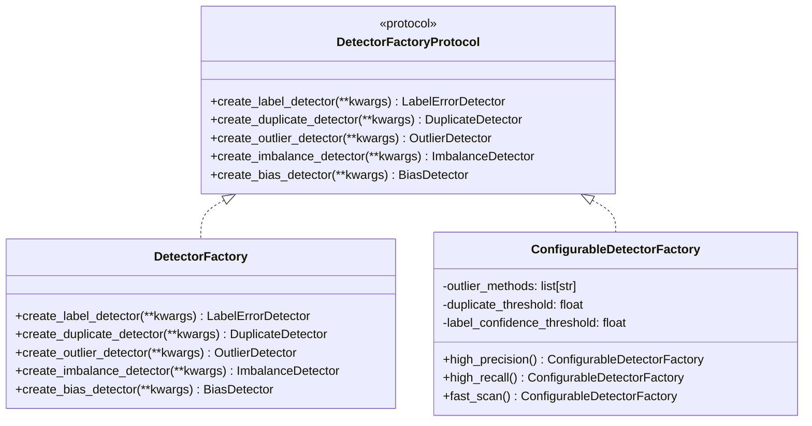

# Detector Factory API Reference

The `clean.detection.factory` module provides dependency injection support for the `DatasetCleaner` through the `DetectorFactory` pattern.

## Overview

The factory pattern enables:
- Easy mocking in unit tests
- Custom detector configurations
- Preset configurations for common use cases
- Decoupled detector instantiation

## Architecture



## Classes

### DetectorFactoryProtocol

Protocol defining the detector factory interface.

```python
class DetectorFactoryProtocol(Protocol):
    """Protocol for detector factories."""
    
    def create_label_detector(self, **kwargs: Any) -> Any:
        """Create a label error detector."""
        ...
    
    def create_duplicate_detector(self, **kwargs: Any) -> Any:
        """Create a duplicate detector."""
        ...
    
    def create_outlier_detector(self, **kwargs: Any) -> Any:
        """Create an outlier detector."""
        ...
    
    def create_imbalance_detector(self, **kwargs: Any) -> Any:
        """Create an imbalance detector."""
        ...
    
    def create_bias_detector(self, **kwargs: Any) -> Any:
        """Create a bias detector."""
        ...
```

---

### DetectorFactory

Default implementation that creates standard detectors.

```python
class DetectorFactory:
    """Default factory for creating standard detectors."""
    
    def create_label_detector(self, **kwargs: Any) -> LabelErrorDetector:
        """Create a LabelErrorDetector with provided kwargs."""
        return LabelErrorDetector(**kwargs)
    
    def create_duplicate_detector(self, **kwargs: Any) -> DuplicateDetector:
        """Create a DuplicateDetector with provided kwargs."""
        return DuplicateDetector(**kwargs)
    
    def create_outlier_detector(self, **kwargs: Any) -> OutlierDetector:
        """Create an OutlierDetector with provided kwargs."""
        return OutlierDetector(**kwargs)
    
    def create_imbalance_detector(self, **kwargs: Any) -> ImbalanceDetector:
        """Create an ImbalanceDetector with provided kwargs."""
        return ImbalanceDetector(**kwargs)
    
    def create_bias_detector(self, **kwargs: Any) -> BiasDetector:
        """Create a BiasDetector with provided kwargs."""
        return BiasDetector(**kwargs)
```

**Example:**
```python
from clean.detection.factory import DetectorFactory
from clean import DatasetCleaner

# Use default factory
factory = DetectorFactory()
cleaner = DatasetCleaner(data=df, label_column="label", detector_factory=factory)
report = cleaner.analyze()
```

---

### ConfigurableDetectorFactory

Factory with configurable presets for common use cases.

```python
class ConfigurableDetectorFactory:
    """Configurable factory with preset configurations."""
    
    def __init__(
        self,
        outlier_methods: list[str] | None = None,
        outlier_contamination: float = 0.1,
        duplicate_threshold: float = 0.9,
        duplicate_methods: list[str] | None = None,
        label_confidence_threshold: float = 0.5,
        bias_protected_attributes: list[str] | None = None,
    ):
```

**Parameters:**
- `outlier_methods`: List of outlier detection methods
- `outlier_contamination`: Expected outlier proportion
- `duplicate_threshold`: Similarity threshold for duplicates
- `duplicate_methods`: List of duplicate detection methods
- `label_confidence_threshold`: Minimum confidence for label errors
- `bias_protected_attributes`: Columns to check for bias

#### Class Methods

##### high_precision

Create factory optimized for high precision (fewer false positives).

```python
@classmethod
def high_precision(cls) -> ConfigurableDetectorFactory:
    """Create factory with high-precision settings."""
    return cls(
        outlier_methods=["isolation_forest", "lof"],
        outlier_contamination=0.05,
        duplicate_threshold=0.95,
        label_confidence_threshold=0.8,
    )
```

**Use case:** When false positives are costly (e.g., removing valid training data).

---

##### high_recall

Create factory optimized for high recall (catch more issues).

```python
@classmethod
def high_recall(cls) -> ConfigurableDetectorFactory:
    """Create factory with high-recall settings."""
    return cls(
        outlier_methods=["zscore", "iqr", "isolation_forest", "lof"],
        outlier_contamination=0.15,
        duplicate_threshold=0.8,
        label_confidence_threshold=0.4,
    )
```

**Use case:** When you want to catch all potential issues for manual review.

---

##### fast_scan

Create factory optimized for speed over accuracy.

```python
@classmethod
def fast_scan(cls) -> ConfigurableDetectorFactory:
    """Create factory with fast-scan settings."""
    return cls(
        outlier_methods=["zscore"],
        outlier_contamination=0.1,
        duplicate_threshold=0.95,
        duplicate_methods=["hash"],
        label_confidence_threshold=0.7,
    )
```

**Use case:** Quick exploratory analysis on large datasets.

---

## Usage Examples

### Basic Usage

```python
from clean import DatasetCleaner
from clean.detection.factory import DetectorFactory

# Default factory
factory = DetectorFactory()
cleaner = DatasetCleaner(
    data=df,
    label_column="label",
    detector_factory=factory,
)
report = cleaner.analyze()
```

### Using Presets

```python
from clean import DatasetCleaner
from clean.detection.factory import ConfigurableDetectorFactory

# High precision for production data cleaning
factory = ConfigurableDetectorFactory.high_precision()
cleaner = DatasetCleaner(data=df, detector_factory=factory)

# Fast scan for exploratory analysis
factory = ConfigurableDetectorFactory.fast_scan()
cleaner = DatasetCleaner(data=df, detector_factory=factory)
```

### Custom Configuration

```python
from clean.detection.factory import ConfigurableDetectorFactory

factory = ConfigurableDetectorFactory(
    outlier_methods=["zscore", "isolation_forest"],
    outlier_contamination=0.08,
    duplicate_threshold=0.92,
    duplicate_methods=["hash", "fuzzy"],
    label_confidence_threshold=0.6,
    bias_protected_attributes=["gender", "age_group"],
)

cleaner = DatasetCleaner(
    data=df,
    label_column="label",
    detector_factory=factory,
)
```

### Testing with Mock Factory

```python
from unittest.mock import MagicMock
from clean import DatasetCleaner

# Create mock factory for testing
mock_factory = MagicMock()
mock_factory.create_outlier_detector.return_value = MagicMock(
    fit_detect=MagicMock(return_value=mock_result)
)

# Inject mock
cleaner = DatasetCleaner(
    data=df,
    detector_factory=mock_factory,
)

# Verify detector was created with expected args
mock_factory.create_outlier_detector.assert_called_once()
```

---

## Integration with DatasetCleaner

The `DatasetCleaner` accepts an optional `detector_factory` parameter:

```python
class DatasetCleaner:
    def __init__(
        self,
        data: pd.DataFrame,
        label_column: str | None = None,
        detector_factory: DetectorFactoryProtocol | None = None,
        # ... other params
    ):
        self._detector_factory = detector_factory or DetectorFactory()
```

When `analyze()` is called, the cleaner uses the factory to create detectors:

```python
def _detect_outliers(self) -> DetectorResult | None:
    detector = self._detector_factory.create_outlier_detector(
        methods=self._outlier_methods,
        contamination=self._contamination,
    )
    return detector.fit_detect(self._features, self._labels)
```

---

## Creating Custom Factories

```python
from clean.detection.factory import DetectorFactoryProtocol
from clean.detection import (
    LabelErrorDetector,
    DuplicateDetector,
    OutlierDetector,
)

class CustomFactory:
    """Custom factory with logging and monitoring."""
    
    def __init__(self, logger):
        self.logger = logger
    
    def create_outlier_detector(self, **kwargs):
        self.logger.info(f"Creating outlier detector: {kwargs}")
        return OutlierDetector(**kwargs)
    
    def create_duplicate_detector(self, **kwargs):
        self.logger.info(f"Creating duplicate detector: {kwargs}")
        return DuplicateDetector(**kwargs)
    
    # ... implement other create methods
```
