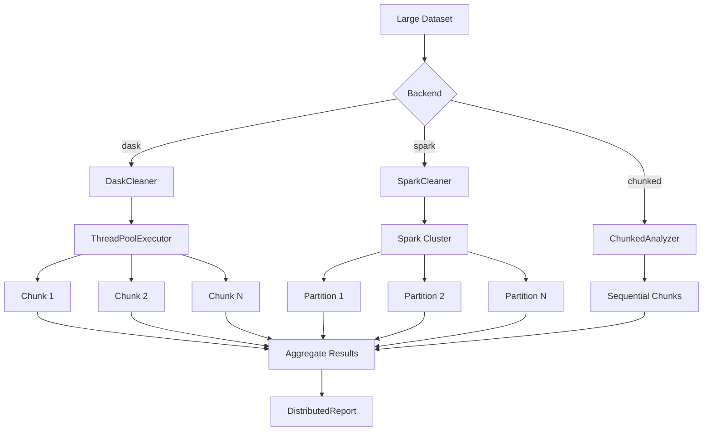

# Distributed Processing

Scale data quality analysis to large datasets using Dask or Spark.

## Overview

For datasets that don't fit in memory, Clean provides distributed backends that process data in parallel chunks while maintaining analysis accuracy.

## DaskCleaner

Parallel processing using Dask-like chunked execution.

::: clean.distributed.DaskCleaner
    options:
      show_root_heading: true
      show_source: false
      members:
        - __init__
        - analyze
        - analyze_file

### Example

```python
from clean import DaskCleaner

# Initialize with worker count
cleaner = DaskCleaner(n_workers=8)

# Analyze large file
report = cleaner.analyze(
    "large_dataset.csv",
    label_column="label",
    chunk_size=100000,
)

print(f"Total samples: {report.total_samples:,}")
print(f"Quality score: {report.overall_quality_score:.1f}")
print(f"Processing time: {report.processing_time_seconds:.1f}s")
```

## ChunkedAnalyzer

Memory-efficient sequential processing for very large files.

::: clean.distributed.ChunkedAnalyzer
    options:
      show_root_heading: true
      show_source: false
      members:
        - __init__
        - analyze_file

### Example

```python
from clean import ChunkedAnalyzer

analyzer = ChunkedAnalyzer(
    chunk_size=50000,
    label_column="label",
)

# Process file in chunks
for chunk_report in analyzer.analyze_file("huge_dataset.csv"):
    print(f"Chunk {chunk_report.chunk_id}: {chunk_report.n_samples} samples")
    print(f"  Quality: {chunk_report.quality_score:.1f}")
    print(f"  Issues: {chunk_report.n_issues}")
```

## SparkCleaner

Apache Spark backend for cluster-scale processing.

::: clean.distributed.SparkCleaner
    options:
      show_root_heading: true
      show_source: false
      members:
        - __init__
        - analyze
        - stop

### Example

```python
from clean.distributed import SparkCleaner

# Initialize Spark cleaner
cleaner = SparkCleaner(
    app_name="CleanDataQuality",
    n_partitions=100,
)

try:
    # Analyze with Spark
    report = cleaner.analyze(
        "hdfs://data/large_dataset.parquet",
        label_column="label",
    )
    print(f"Processed {report.total_samples:,} samples")
finally:
    cleaner.stop()  # Clean up Spark session
```

## DistributedReport

Results from distributed analysis.

::: clean.distributed.DistributedReport
    options:
      show_root_heading: true
      show_source: false
      members:
        - summary
        - to_dict
        - get_chunk_reports

### Report Details

```python
# Overall metrics
print(f"Total samples: {report.total_samples:,}")
print(f"Total chunks: {report.total_chunks}")
print(f"Overall quality: {report.overall_quality_score:.1f}")
print(f"Processing time: {report.processing_time_seconds:.1f}s")

# Per-chunk breakdown
for chunk in report.get_chunk_reports():
    print(f"Chunk {chunk.chunk_id}: {chunk.quality_score:.1f}")
```

## Convenience Function

### analyze_distributed

```python
from clean import analyze_distributed

# Automatically choose backend
report = analyze_distributed(
    "large_dataset.csv",
    label_column="label",
    backend="dask",      # or "spark"
    n_workers=8,
    chunk_size=100000,
)
```

## Configuration

### DistributedConfig

```python
from clean.distributed import DistributedConfig

config = DistributedConfig(
    n_workers=8,
    chunk_size=100000,
    memory_limit="4GB",
    timeout=3600,
)

cleaner = DaskCleaner(config=config)
```

## Backend Comparison

| Feature | DaskCleaner | ChunkedAnalyzer | SparkCleaner |
|---------|-------------|-----------------|--------------|
| Parallelism | Multi-threaded | Sequential | Distributed |
| Memory | Bounded | Minimal | Cluster-managed |
| Setup | None | None | Spark cluster |
| Best for | Single machine | Memory-constrained | Cluster scale |
| File formats | CSV, Parquet | CSV, Parquet | All Spark formats |

## Processing Large Files

### CSV Files

```python
# Process large CSV
report = analyze_distributed(
    "data.csv",
    backend="dask",
    chunk_size=100000,
)
```

### Parquet Files

```python
# Process Parquet (more efficient)
report = analyze_distributed(
    "data.parquet",
    backend="dask",
    chunk_size=100000,
)
```

### Multiple Files

```python
from pathlib import Path

# Process directory of files
files = list(Path("data/").glob("*.csv"))
results = []

cleaner = DaskCleaner(n_workers=8)
for file in files:
    report = cleaner.analyze(file, label_column="label")
    results.append(report)
```

## Architecture



## Performance Tips

1. **Choose chunk size wisely**: Larger chunks = fewer overhead, but more memory
2. **Match workers to cores**: `n_workers` ≈ CPU cores for CPU-bound work
3. **Use Parquet**: Columnar format is more efficient than CSV
4. **Pre-filter if possible**: Reduce data volume before analysis
5. **Monitor memory**: Watch for OOM errors and adjust chunk size

## Memory Estimation

```python
# Estimate memory requirements
import pandas as pd

# Sample to estimate row size
sample = pd.read_csv("data.csv", nrows=1000)
bytes_per_row = sample.memory_usage(deep=True).sum() / len(sample)

# Calculate chunk size for target memory
target_memory_mb = 500
chunk_size = int((target_memory_mb * 1024 * 1024) / bytes_per_row)
print(f"Recommended chunk size: {chunk_size:,}")
```
