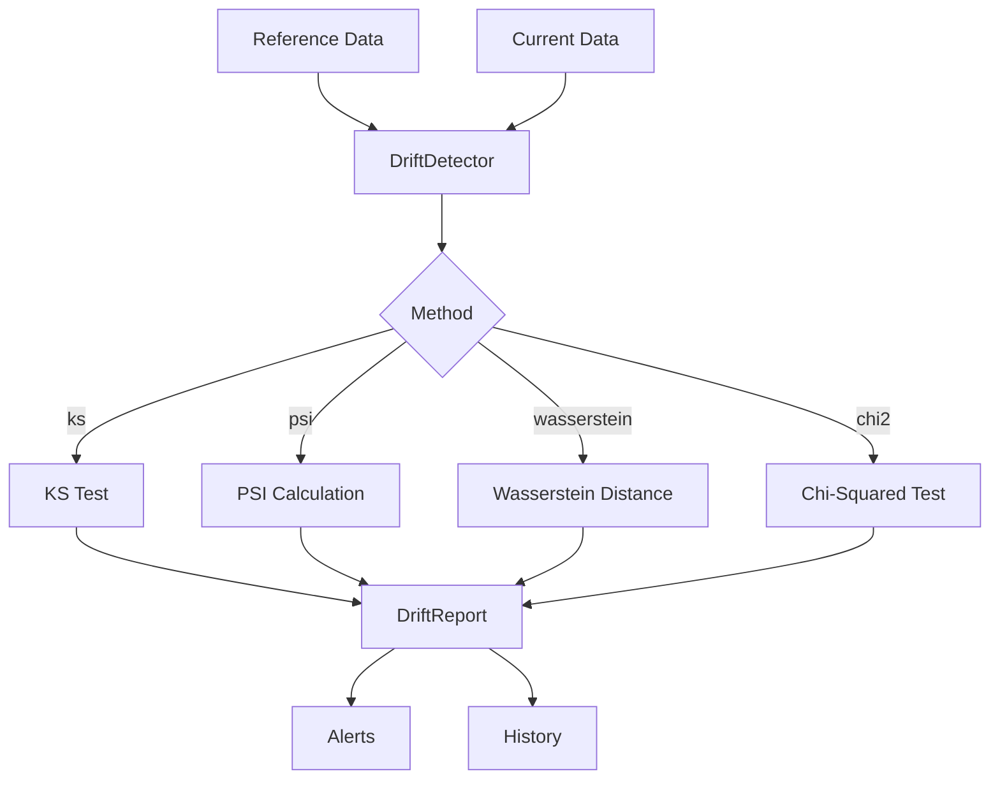

# Data Drift Detection

Monitor and detect distribution shifts in your data over time.

## Overview

Data drift occurs when the statistical properties of your data change, potentially degrading model performance. Clean provides tools for both one-time drift detection and continuous monitoring.

## DriftDetector

Detects distribution shifts between reference and current datasets.

::: clean.drift.DriftDetector
    options:
      show_root_heading: true
      show_source: false
      members:
        - __init__
        - detect
        - get_feature_drifts

### Example

```python
from clean import DriftDetector

# Initialize detector
detector = DriftDetector(
    method="ks",           # ks, psi, wasserstein, chi2
    threshold=0.05,        # p-value threshold for drift
    feature_columns=None,  # Auto-detect numeric columns
)

# Detect drift
report = detector.detect(reference_df, current_df)

print(f"Drift detected: {report.drift_detected}")
print(f"Overall score: {report.overall_drift_score:.3f}")

# Per-feature analysis
for feature, result in report.feature_results.items():
    if result.is_drifted:
        print(f"  {feature}: p={result.p_value:.4f}, statistic={result.statistic:.3f}")
```

## DriftMonitor

Continuous monitoring with alerting capabilities.

::: clean.drift.DriftMonitor
    options:
      show_root_heading: true
      show_source: false
      members:
        - __init__
        - check
        - add_alert_handler
        - get_history

### Example

```python
from clean import DriftMonitor

# Create monitor with reference data
monitor = DriftMonitor(
    reference_data=baseline_df,
    alert_threshold=0.05,
    methods=["ks", "psi"],
)

# Add alert handler
def handle_alert(alert):
    print(f"🚨 Drift Alert: {alert.feature} - {alert.message}")
    # Send to Slack, PagerDuty, etc.

monitor.add_alert_handler(handle_alert)

# Check new data batches
for batch in data_stream:
    report = monitor.check(batch)
    if report.drift_detected:
        print(f"Drift detected in {len(report.drifted_features)} features")

# View history
history = monitor.get_history()
```

## DriftReport

Results from drift detection.

::: clean.drift.DriftReport
    options:
      show_root_heading: true
      show_source: false
      members:
        - summary
        - to_dict

## Convenience Function

### detect_drift

```python
from clean import detect_drift

report = detect_drift(
    reference=baseline_df,
    current=new_df,
    method="ks",
    threshold=0.05,
)
```

## Detection Methods

| Method | Best For | Description |
|--------|----------|-------------|
| `ks` | Numerical | Kolmogorov-Smirnov test for distribution equality |
| `psi` | Numerical/Categorical | Population Stability Index |
| `wasserstein` | Numerical | Earth mover's distance between distributions |
| `chi2` | Categorical | Chi-squared test for categorical variables |

## Architecture


