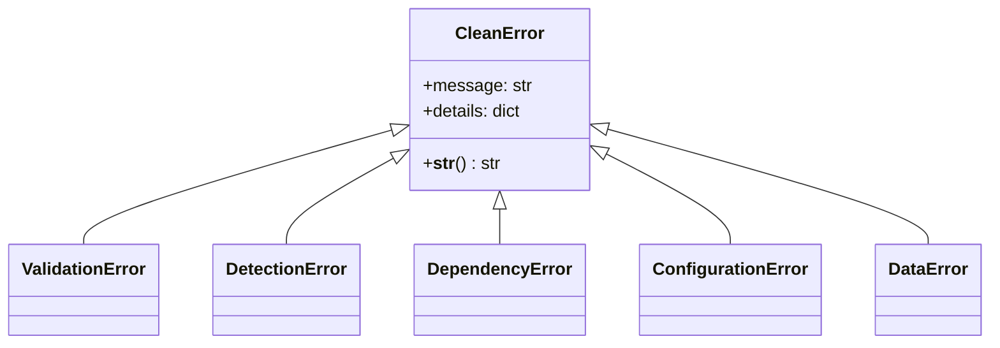

# Exceptions API Reference

The `clean.exceptions` module provides a domain-specific exception hierarchy for consistent error handling across the Clean library.

## Overview

All Clean exceptions inherit from `CleanError`, providing:
- Consistent error messages
- Detailed error information via `details` dict
- Clear installation instructions for optional dependencies

## Exception Hierarchy



## Classes

### CleanError

Base exception for all Clean library errors.

```python
class CleanError(Exception):
    """Base exception for all Clean library errors."""
    
    def __init__(self, message: str, **details: Any):
        """Initialize error with message and optional details.
        
        Args:
            message: Human-readable error description
            **details: Additional context as keyword arguments
        """
```

**Example:**
```python
from clean.exceptions import CleanError

try:
    raise CleanError("Something went wrong", operation="analyze", code=42)
except CleanError as e:
    print(e.message)  # "Something went wrong"
    print(e.details)  # {"operation": "analyze", "code": 42}
```

---

### ValidationError

Raised when input validation fails.

```python
class ValidationError(CleanError):
    """Raised when input validation fails."""
    
    def __init__(
        self,
        message: str,
        field: str | None = None,
        expected: str | None = None,
        actual: str | None = None,
        **details: Any,
    ):
```

**Parameters:**
- `field`: Name of the invalid field
- `expected`: Description of expected value
- `actual`: The actual invalid value received

**Example:**
```python
from clean.exceptions import ValidationError

raise ValidationError(
    "Invalid label column",
    field="label_column",
    expected="string column name",
    actual="None",
)
```

---

### DetectionError

Raised when a detector encounters an error.

```python
class DetectionError(CleanError):
    """Raised when a detector encounters an error."""
    
    def __init__(
        self,
        message: str,
        detector: str | None = None,
        phase: str | None = None,
        **details: Any,
    ):
```

**Parameters:**
- `detector`: Name of the detector that failed
- `phase`: Phase where error occurred ("fit", "detect", "transform")

**Example:**
```python
from clean.exceptions import DetectionError

raise DetectionError(
    "Insufficient samples for LOF",
    detector="OutlierDetector",
    phase="fit",
    n_samples=5,
    min_required=20,
)
```

---

### DependencyError

Raised when an optional dependency is required but not installed.

```python
class DependencyError(CleanError):
    """Raised when an optional dependency is not installed."""
    
    def __init__(
        self,
        package: str,
        install_extra: str | None = None,
        feature: str | None = None,
        **details: Any,
    ):
```

**Parameters:**
- `package`: Name of the missing package
- `install_extra`: pip extra to install (e.g., "text", "image")
- `feature`: Feature that requires the package

**Properties:**
- `install_command`: Full pip install command

**Example:**
```python
from clean.exceptions import DependencyError

try:
    from sentence_transformers import SentenceTransformer
except ImportError:
    raise DependencyError(
        "sentence-transformers",
        install_extra="text",
        feature="text embeddings",
    )
# Error message: "sentence-transformers is required for text embeddings. 
#                Install with: pip install clean-data-quality[text]"
```

---

### ConfigurationError

Raised when configuration is invalid.

```python
class ConfigurationError(CleanError):
    """Raised when configuration is invalid."""
    
    def __init__(
        self,
        message: str,
        parameter: str | None = None,
        reason: str | None = None,
        **details: Any,
    ):
```

**Parameters:**
- `parameter`: Name of the invalid parameter
- `reason`: Why the configuration is invalid

**Example:**
```python
from clean.exceptions import ConfigurationError

raise ConfigurationError(
    "Invalid contamination value",
    parameter="contamination",
    reason="Must be between 0 and 0.5",
    value=0.8,
)
```

---

### DataError

Raised when there are issues with input data.

```python
class DataError(CleanError):
    """Raised when there are issues with input data."""
    
    def __init__(
        self,
        message: str,
        column: str | None = None,
        issue: str | None = None,
        **details: Any,
    ):
```

**Parameters:**
- `column`: Column with the issue
- `issue`: Description of the data issue

**Example:**
```python
from clean.exceptions import DataError

raise DataError(
    "Column contains only NaN values",
    column="feature_1",
    issue="all_nan",
    n_rows=1000,
)
```

---

## Usage Patterns

### Catching Specific Exceptions

```python
from clean.exceptions import (
    CleanError,
    ValidationError,
    DependencyError,
)

try:
    cleaner.analyze()
except DependencyError as e:
    print(f"Install required package: {e.install_command}")
except ValidationError as e:
    print(f"Invalid input: {e.field} - {e.message}")
except CleanError as e:
    print(f"Clean error: {e}")
```

### Accessing Error Details

```python
try:
    detector.fit(features, labels)
except DetectionError as e:
    print(f"Detector: {e.details.get('detector')}")
    print(f"Phase: {e.details.get('phase')}")
    print(f"Full details: {e.details}")
```

### Re-raising with Context

```python
from clean.exceptions import DetectionError

try:
    model.fit(X)
except ValueError as e:
    raise DetectionError(
        str(e),
        detector="OutlierDetector",
        phase="fit",
    ) from e
```
