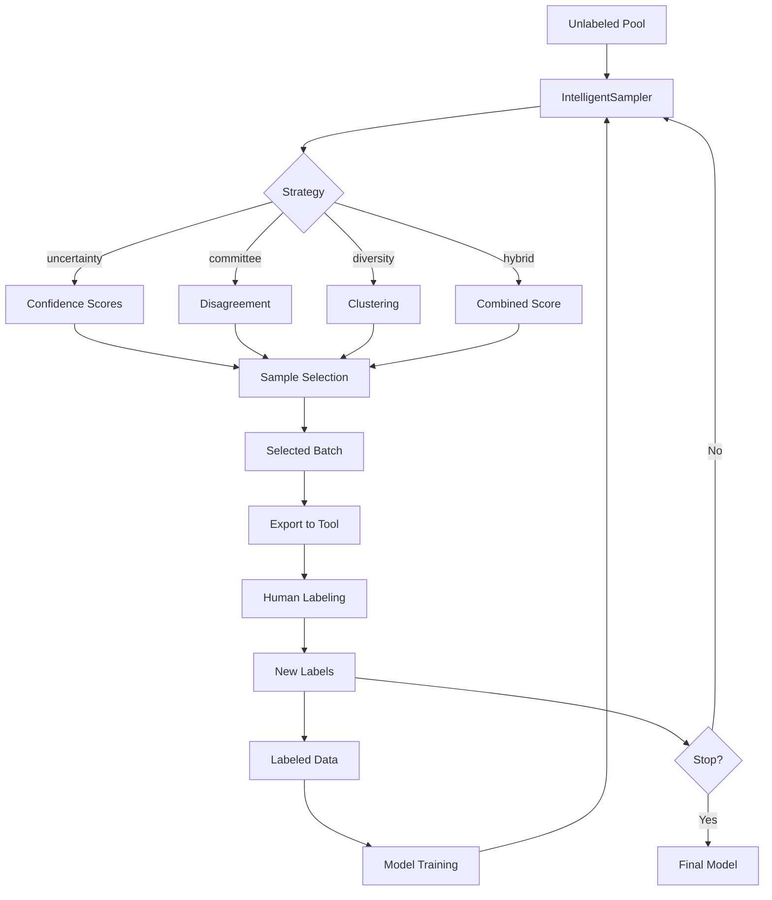

# Intelligent Sampling for Labeling

Advanced active learning strategies for efficient human labeling.

## Overview

Labeling data is expensive. The intelligent sampling module helps you select the most informative samples for human labeling, maximizing label efficiency. It builds on the existing active learning module with advanced query strategies and human-in-the-loop learning.

## IntelligentSampler

Advanced sampler with multiple query strategies.

::: clean.active_learning.IntelligentSampler
    options:
      show_root_heading: true
      show_source: false
      members:
        - __init__
        - fit
        - select
        - update
        - get_metrics

### Example

```python
from clean.active_learning import IntelligentSampler

# Initialize sampler
sampler = IntelligentSampler(
    strategy="hybrid",
    exploration_weight=0.3,
    diversity_weight=0.2,
)

# Fit on labeled data
sampler.fit(X_labeled, y_labeled)

# Select samples for labeling
indices = sampler.select(
    X_unlabeled,
    n_samples=100,
    batch_mode="diverse",  # diverse, sequential, clustered
)

# Get selected samples
samples_to_label = X_unlabeled[indices]

# After labeling, update the model
sampler.update(samples_to_label, new_labels)
```

## Query Strategies

### Uncertainty Sampling

Select samples where the model is least confident.

```python
sampler = IntelligentSampler(strategy="uncertainty")

# Variants
sampler = IntelligentSampler(
    strategy="uncertainty",
    uncertainty_method="entropy",  # entropy, margin, least_confident
)
```

### Query by Committee

Use disagreement between multiple models.

```python
from clean.active_learning import QueryByCommittee

committee = QueryByCommittee(
    n_estimators=5,
    base_estimator="random_forest",
)

committee.fit(X_labeled, y_labeled)
indices = committee.select(X_unlabeled, n_samples=100)

# View committee disagreement
disagreements = committee.get_disagreement_scores(X_unlabeled)
```

### Expected Model Change

Select samples that would most change the model.

```python
from clean.active_learning import ExpectedModelChange

emc = ExpectedModelChange(
    model="logistic_regression",
    gradient_method="empirical",
)

emc.fit(X_labeled, y_labeled)
indices = emc.select(X_unlabeled, n_samples=100)
```

### Diversity Sampling

Ensure selected samples cover the data distribution.

```python
sampler = IntelligentSampler(
    strategy="diversity",
    diversity_method="kmeans",  # kmeans, coreset, determinantal
)
```

### Hybrid Strategy

Combine uncertainty and diversity.

```python
sampler = IntelligentSampler(
    strategy="hybrid",
    uncertainty_weight=0.6,
    diversity_weight=0.4,
)
```

## Batch Selection

### Diverse Batches

Ensure batch diversity to avoid redundancy:

```python
indices = sampler.select(
    X_unlabeled,
    n_samples=100,
    batch_mode="diverse",
    batch_diversity_threshold=0.5,
)
```

### Clustered Batches

Select representative samples from each cluster:

```python
indices = sampler.select(
    X_unlabeled,
    n_samples=100,
    batch_mode="clustered",
    n_clusters=10,
)
```

## Human-in-the-Loop Learning

### Iterative Labeling Workflow

```python
from clean.active_learning import IntelligentSampler, LabelingSession

# Start labeling session
session = LabelingSession(
    sampler=sampler,
    X_unlabeled=X_unlabeled,
    export_format="label_studio",
)

# Iteration 1
batch1 = session.get_next_batch(n_samples=50)
# ... label batch1 ...
session.submit_labels(batch1_indices, batch1_labels)

# Iteration 2 (model updated automatically)
batch2 = session.get_next_batch(n_samples=50)
# ... continue iterating ...

# View progress
print(f"Samples labeled: {session.n_labeled}")
print(f"Estimated accuracy: {session.estimated_accuracy:.1%}")
```

### Stopping Criteria

```python
# Stop when performance plateaus
session = LabelingSession(
    sampler=sampler,
    stopping_criteria={
        "min_accuracy": 0.95,
        "accuracy_plateau_rounds": 3,
        "max_samples": 1000,
    }
)

while not session.should_stop():
    batch = session.get_next_batch(n_samples=50)
    labels = label_samples(batch)  # Your labeling function
    session.submit_labels(batch, labels)

print(f"Stopped after {session.n_labeled} samples")
print(f"Final accuracy: {session.estimated_accuracy:.1%}")
```

## Export to Labeling Tools

### Label Studio

```python
from clean.active_learning import LabelStudioExporter

exporter = LabelStudioExporter(
    project_name="Quality Review",
    label_config_type="classification",
)

exporter.export(
    samples=X_unlabeled[indices],
    sample_ids=indices,
    output_path="label_studio_tasks.json",
    metadata={"source": "active_learning"},
)
```

### CVAT

```python
from clean.active_learning import CVATExporter

exporter = CVATExporter(
    task_name="Image Classification",
    labels=["cat", "dog", "bird"],
)

exporter.export(
    image_paths=image_paths[indices],
    output_path="cvat_tasks.xml",
)
```

### Prodigy

```python
from clean.active_learning import ProdigyExporter

exporter = ProdigyExporter()

exporter.export(
    texts=texts[indices],
    output_path="prodigy_tasks.jsonl",
    task_type="textcat",
    labels=["positive", "negative"],
)
```

## Metrics and Analysis

```python
# View sampling efficiency
metrics = sampler.get_metrics()

print(f"Selection efficiency: {metrics.efficiency:.2f}")
print(f"Diversity score: {metrics.diversity:.2f}")
print(f"Estimated label savings: {metrics.label_savings:.1%}")

# Compare strategies
from clean.active_learning import compare_strategies

comparison = compare_strategies(
    X_train, y_train, X_test, y_test,
    strategies=["uncertainty", "diversity", "hybrid", "random"],
    n_iterations=10,
    samples_per_iteration=50,
)

comparison.plot_learning_curves()
```

## Architecture



## Best Practices

1. **Start with uncertainty**: Most effective for initial rounds
2. **Add diversity later**: Prevents sampling similar instances repeatedly
3. **Use batch diversity**: Avoid redundant samples in each batch
4. **Monitor stopping criteria**: Don't over-label
5. **Validate with held-out set**: Track true performance improvement
