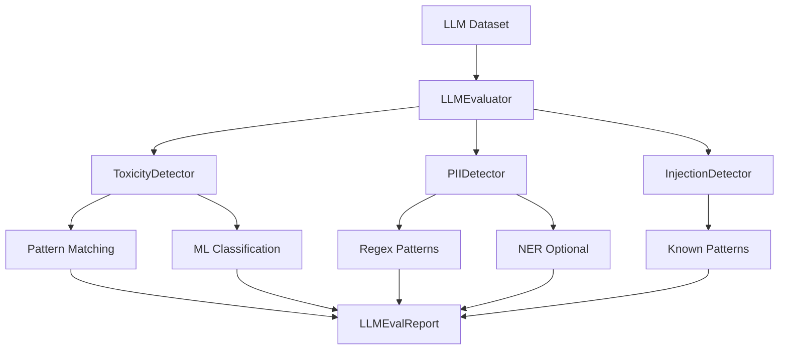

# LLM Evaluation Suite

Evaluate safety, quality, and compliance of LLM training and inference data.

## Overview

LLM datasets require specialized quality checks beyond traditional ML. Clean detects toxicity, PII leakage, prompt injection attempts, and evaluates response quality.

## LLMEvaluator

Comprehensive evaluation of LLM prompt-response pairs.

::: clean.llm_eval.LLMEvaluator
    options:
      show_root_heading: true
      show_source: false
      members:
        - __init__
        - evaluate
        - evaluate_sample

### Example

```python
from clean import LLMEvaluator

evaluator = LLMEvaluator(
    check_toxicity=True,
    check_pii=True,
    check_injection=True,
    toxicity_threshold=0.5,
)

report = evaluator.evaluate(
    df,
    prompt_column="instruction",
    response_column="output",
)

print(f"Safety Score: {report.safety_score:.1f}/100")
print(f"Samples analyzed: {report.total_samples}")
print(f"")
print(f"Issues found:")
print(f"  Toxicity: {report.toxicity_count}")
print(f"  PII detected: {report.pii_count}")
print(f"  Prompt injections: {report.injection_count}")
```

## LLMEvalReport

Results from LLM evaluation.

::: clean.llm_eval.LLMEvalReport
    options:
      show_root_heading: true
      show_source: false
      members:
        - summary
        - to_dict
        - get_flagged_samples

### Getting Flagged Samples

```python
# Get all problematic samples
flagged = report.get_flagged_samples()

for idx, issues in flagged.items():
    print(f"Sample {idx}: {', '.join(issues)}")

# Filter by issue type
toxic_samples = report.get_flagged_samples(issue_type="toxicity")
pii_samples = report.get_flagged_samples(issue_type="pii")
```

## Helper Classes

### ToxicityDetector

Detects harmful, offensive, or inappropriate content.

```python
from clean.llm_eval import ToxicityDetector

detector = ToxicityDetector(threshold=0.5)

# Check single text
result = detector.detect("Some text to check")
print(f"Is toxic: {result.is_toxic}")
print(f"Score: {result.score:.2f}")
print(f"Categories: {result.categories}")
```

### PIIDetector

Detects personally identifiable information.

```python
from clean.llm_eval import PIIDetector

detector = PIIDetector()

result = detector.detect("Contact john@example.com or call 555-1234")
print(f"PII found: {result.has_pii}")
print(f"Types: {result.pii_types}")  # ['email', 'phone']
print(f"Entities: {result.entities}")
```

**Detected PII Types:**

| Type | Examples |
|------|----------|
| `email` | john@example.com |
| `phone` | 555-123-4567, (555) 123-4567 |
| `ssn` | 123-45-6789 |
| `credit_card` | 4111-1111-1111-1111 |
| `ip_address` | 192.168.1.1 |

## Convenience Function

### evaluate_llm_data

```python
from clean import evaluate_llm_data

report = evaluate_llm_data(
    df,
    prompt_column="prompt",
    response_column="response",
    check_toxicity=True,
    check_pii=True,
)
```

## Safety Categories

```python
from clean.llm_eval import SafetyCategory

# Available categories
SafetyCategory.TOXICITY      # Harmful/offensive content
SafetyCategory.PII           # Personal information
SafetyCategory.INJECTION     # Prompt injection attempts
SafetyCategory.REFUSAL       # Model refusals
SafetyCategory.HALLUCINATION # Factual inconsistencies
```

## Architecture



## Best Practices

1. **Run before training**: Catch issues before they're learned by the model
2. **Sample review**: Manually verify flagged samples to tune thresholds
3. **Iterative cleaning**: Re-run after fixes to ensure issues are resolved
4. **Document exceptions**: Some flagged content may be intentional (e.g., safety training data)
