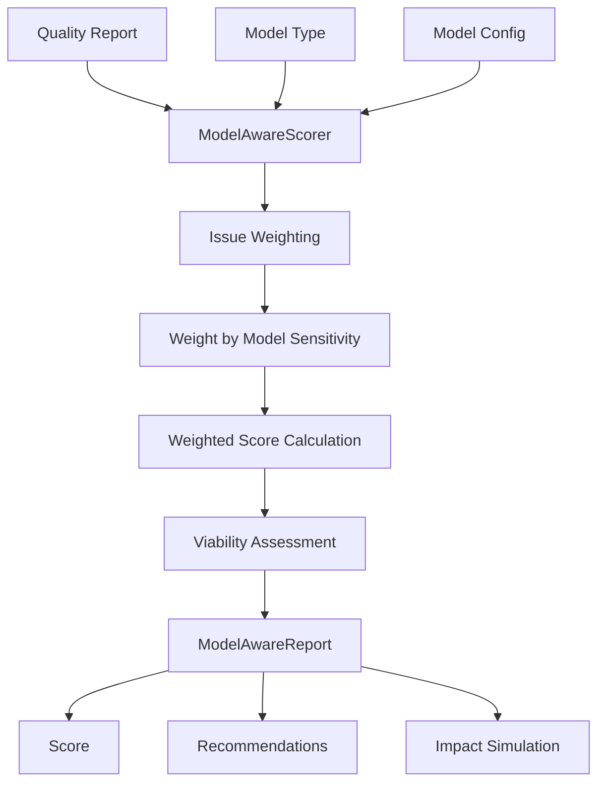

# Model-Aware Quality Scoring

Quality metrics tailored to specific ML model types and training objectives.

## Overview

Different ML models have different sensitivity to data quality issues. A small amount of label noise might be tolerable for a robust ensemble but catastrophic for a neural network. The model-aware module calculates quality scores specific to your target model architecture.

## ModelAwareScorer

Main class for model-specific quality assessment.

::: clean.model_aware.ModelAwareScorer
    options:
      show_root_heading: true
      show_source: false
      members:
        - __init__
        - score
        - get_recommendations
        - simulate_impact

### Example

```python
from clean.model_aware import ModelAwareScorer

# Initialize scorer for your target model
scorer = ModelAwareScorer(
    model_type="neural_network",
    task="classification",
    model_config={
        "architecture": "transformer",
        "size": "large",
    }
)

# Get model-specific quality score
result = scorer.score(
    data=df,
    labels=labels,
    quality_report=report,
)

print(f"Model-Aware Quality Score: {result.score:.1f}/100")
print(f"Training viability: {result.viability}")
print(f"Estimated performance impact: {result.performance_impact:.1%}")
```

## Model Types

### Supported Model Types

| Model Type | Sensitivity Profile |
|------------|-------------------|
| `neural_network` | High sensitivity to noise, duplicates |
| `decision_tree` | Robust to noise, sensitive to imbalance |
| `random_forest` | Very robust, moderate imbalance sensitivity |
| `gradient_boosting` | Moderate noise sensitivity |
| `svm` | High sensitivity to outliers |
| `linear` | Moderate noise sensitivity, needs balance |
| `knn` | Very sensitive to duplicates, outliers |

### Configuration

```python
# Neural network with specific architecture
scorer = ModelAwareScorer(
    model_type="neural_network",
    model_config={
        "architecture": "transformer",  # cnn, rnn, mlp, transformer
        "size": "large",                # small, medium, large
        "regularization": "dropout",    # none, dropout, weight_decay
    }
)

# Gradient boosting with hyperparameters
scorer = ModelAwareScorer(
    model_type="gradient_boosting",
    model_config={
        "n_estimators": 1000,
        "max_depth": 6,
        "learning_rate": 0.1,
    }
)
```

## ModelAwareReport

::: clean.model_aware.ModelAwareReport
    options:
      show_root_heading: true
      show_source: false

| Attribute | Type | Description |
|-----------|------|-------------|
| `score` | float | 0-100 quality score for target model |
| `viability` | str | "excellent", "good", "fair", "poor", "untrainable" |
| `sample_qualities` | list | Per-sample quality assessments |
| `class_metrics` | dict | Metrics per class |
| `recommendations` | list | Prioritized cleanup actions |

## Issue Weighting

Different models weight quality issues differently:

```python
result = scorer.score(data, labels, report)

# View model-specific weights
for issue, weight in result.issue_weights.items():
    print(f"{issue}: {weight:.2f}x impact")

# Example output for neural network:
# label_errors: 2.5x impact
# duplicates: 1.8x impact
# outliers: 1.2x impact
# imbalance: 1.5x impact
```

## Impact Simulation

Simulate how fixing issues would improve model performance:

```python
# Simulate fixing specific issues
simulation = scorer.simulate_impact(
    data=df,
    labels=labels,
    quality_report=report,
    fix_scenarios=[
        {"fix": "label_errors", "fraction": 0.5},
        {"fix": "duplicates", "fraction": 1.0},
    ]
)

for scenario in simulation.scenarios:
    print(f"Fix {scenario.description}:")
    print(f"  Score: {scenario.before_score:.1f} → {scenario.after_score:.1f}")
    print(f"  Est. accuracy gain: +{scenario.accuracy_gain:.1%}")
```

## Recommendations

Get prioritized cleanup recommendations for your model:

```python
recommendations = scorer.get_recommendations(
    data=df,
    labels=labels,
    quality_report=report,
    budget="medium",  # low, medium, high effort
)

for i, rec in enumerate(recommendations, 1):
    print(f"{i}. {rec.action}")
    print(f"   Priority: {rec.priority}")
    print(f"   Effort: {rec.effort}")
    print(f"   Impact: +{rec.expected_improvement:.1%}")
```

## Convenience Function

### score_for_model

```python
from clean.model_aware import score_for_model

result = score_for_model(
    data=df,
    labels=labels,
    model_type="neural_network",
    quality_report=report,
)

print(f"Score: {result.score:.1f}")
print(f"Viability: {result.viability}")
```

## Architecture



## Model Sensitivity Reference

### Label Errors

| Model Type | Sensitivity | Notes |
|------------|-------------|-------|
| Neural Network | High | Memorizes noise easily |
| Decision Tree | Medium | Splits may follow noise |
| Random Forest | Low | Averaging reduces impact |
| Gradient Boosting | Medium | Sequential correction helps |
| SVM | Medium | Margin affected by mislabels |
| KNN | High | Direct neighbor influence |

### Duplicates

| Model Type | Sensitivity | Notes |
|------------|-------------|-------|
| Neural Network | High | Overfitting risk |
| Decision Tree | Low | Only affects if at split points |
| Random Forest | Low | Sampling dilutes impact |
| KNN | Very High | Directly skews voting |

### Outliers

| Model Type | Sensitivity | Notes |
|------------|-------------|-------|
| SVM | Very High | Margin distortion |
| Linear | High | Leverage points |
| Neural Network | Medium | Can overfit to outliers |
| Tree-based | Low | Isolated in leaves |

## Best Practices

1. **Always specify your target model**: Generic scores may not reflect actual training impact
2. **Use simulation before cleaning**: Estimate ROI of cleanup efforts
3. **Consider model robustness**: Sometimes using a more robust model is easier than cleaning
4. **Iterate**: Clean highest-impact issues first, then re-score
