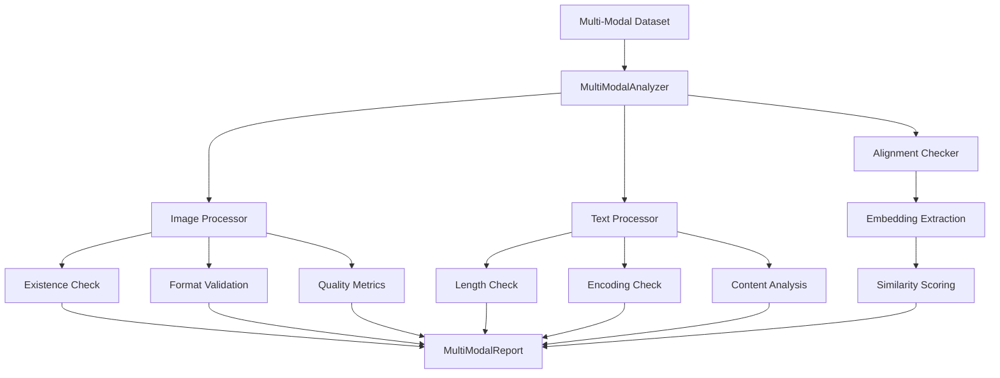

# Multi-Modal Analysis

Analyze consistency and quality across different data modalities.

## Overview

Multi-modal datasets (image-text, video-audio, etc.) require cross-modal consistency checks. Clean detects misaligned pairs, missing modalities, and per-modality quality issues.

## MultiModalAnalyzer

Analyzes multi-modal data for consistency and quality.

::: clean.multimodal.MultiModalAnalyzer
    options:
      show_root_heading: true
      show_source: false
      members:
        - __init__
        - analyze
        - check_alignment

### Example

```python
from clean import MultiModalAnalyzer

analyzer = MultiModalAnalyzer(
    modalities=["image", "text"],
    alignment_threshold=0.5,
)

report = analyzer.analyze(
    df,
    image_column="image_path",
    text_column="caption",
)

print(f"Alignment Score: {report.alignment_score:.2f}")
print(f"Misaligned pairs: {report.n_misaligned}")
print(f"Missing images: {report.missing_counts['image']}")
print(f"Missing captions: {report.missing_counts['text']}")
```

## MultiModalReport

Results from multi-modal analysis.

::: clean.multimodal.MultiModalReport
    options:
      show_root_heading: true
      show_source: false
      members:
        - summary
        - to_dict
        - get_misaligned
        - get_modality_issues

### Finding Misaligned Pairs

```python
# Get misaligned image-text pairs
misaligned = report.get_misaligned(threshold=0.3)

for idx, info in misaligned.items():
    print(f"Sample {idx}:")
    print(f"  Alignment score: {info['score']:.2f}")
    print(f"  Image: {info['image_path']}")
    print(f"  Text: {info['text'][:50]}...")
```

### Per-Modality Issues

```python
# Get issues for each modality
for modality, issues in report.modality_issues.items():
    print(f"\n{modality.upper()} Issues:")
    print(f"  Missing: {issues['missing']}")
    print(f"  Low quality: {issues['low_quality']}")
    print(f"  Corrupted: {issues['corrupted']}")
```

## Convenience Function

### analyze_multimodal

```python
from clean import analyze_multimodal

report = analyze_multimodal(
    df,
    modalities={"image": "image_path", "text": "caption"},
    check_alignment=True,
)
```

## Supported Modalities

| Modality | Column Types | Checks Performed |
|----------|--------------|------------------|
| `image` | File paths, URLs, base64 | Existence, format, dimensions |
| `text` | Strings | Length, language, encoding |
| `audio` | File paths, URLs | Existence, format, duration |
| `video` | File paths, URLs | Existence, format, frames |
| `embedding` | Numeric arrays | Dimensions, NaN values |

## Alignment Checking

```python
# Check image-text alignment using CLIP embeddings
analyzer = MultiModalAnalyzer(
    modalities=["image", "text"],
    alignment_model="clip",  # Uses CLIP for alignment scoring
)

report = analyzer.analyze(df, image_column="image", text_column="caption")

# Samples below threshold are flagged
for idx in report.get_misaligned():
    print(f"Review sample {idx}: caption may not match image")
```

## Quality Checks

### Image Quality

```python
# Image-specific checks
image_issues = report.get_modality_issues("image")

# Issues detected:
# - Missing files
# - Corrupted images
# - Extreme dimensions (too small/large)
# - Unusual aspect ratios
# - Low contrast/blurry (optional)
```

### Text Quality

```python
# Text-specific checks
text_issues = report.get_modality_issues("text")

# Issues detected:
# - Empty/missing text
# - Too short/long
# - Encoding issues
# - Language mismatches
# - Repetitive content
```

## Architecture



## Use Cases

### Image Captioning Datasets

```python
analyzer = MultiModalAnalyzer(modalities=["image", "text"])
report = analyzer.analyze(
    captions_df,
    image_column="image_file",
    text_column="caption",
)

# Find captions that don't match images
misaligned = report.get_misaligned(threshold=0.4)
```

### Video-Text Datasets

```python
analyzer = MultiModalAnalyzer(modalities=["video", "text"])
report = analyzer.analyze(
    video_df,
    video_column="video_path",
    text_column="description",
)
```

### Multimodal Embeddings

```python
# Validate pre-computed embeddings
analyzer = MultiModalAnalyzer(modalities=["image_embedding", "text_embedding"])
report = analyzer.analyze(
    df,
    image_embedding_column="img_emb",
    text_embedding_column="txt_emb",
)
```

## Best Practices

1. **Check alignment early**: Misaligned data hurts model training
2. **Handle missing data**: Decide whether to impute or remove
3. **Validate file paths**: Ensure all referenced files exist
4. **Sample review**: Manually verify flagged misalignments
5. **Use appropriate thresholds**: Tune based on your quality needs
