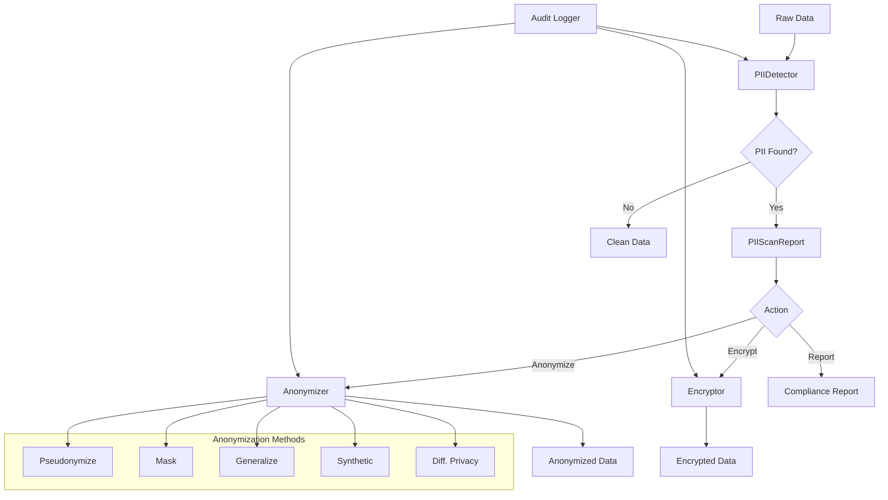

# Data Privacy Vault

PII detection, anonymization, and compliance-ready data handling.

## Overview

The privacy module helps you identify and protect sensitive information in your datasets. It provides PII detection, multiple anonymization techniques, encryption, and audit logging for compliance requirements.

## PrivacyVault

Main class for privacy-preserving data operations.

::: clean.privacy.PrivacyVault
    options:
      show_root_heading: true
      show_source: false
      members:
        - __init__
        - scan
        - anonymize
        - encrypt
        - audit_log

### Example

```python
from clean.privacy import PrivacyVault

# Initialize vault
vault = PrivacyVault(
    pii_types=["email", "phone", "ssn", "name", "address"],
    anonymization_method="pseudonymize",
)

# Scan for PII
scan_result = vault.scan(df)

print(f"PII found in {scan_result.columns_with_pii} columns")
for column, findings in scan_result.findings.items():
    print(f"  {column}:")
    for pii_type, count in findings.items():
        print(f"    {pii_type}: {count} instances")

# Anonymize
anonymized_df = vault.anonymize(df)

# Verify anonymization
verification = vault.verify_anonymization(df, anonymized_df)
print(f"Anonymization complete: {verification.success}")
```

## PII Detection

### Supported PII Types

| PII Type | Detection Method | Example |
|----------|------------------|---------|
| `email` | Regex | user@example.com |
| `phone` | Regex + validation | +1-555-123-4567 |
| `ssn` | Regex + checksum | 123-45-6789 |
| `credit_card` | Regex + Luhn | 4111-1111-1111-1111 |
| `name` | NER + patterns | John Smith |
| `address` | NER + patterns | 123 Main St |
| `ip_address` | Regex | 192.168.1.1 |
| `date_of_birth` | Regex + context | 01/15/1990 |

### PIIDetector

::: clean.privacy.PIIDetector
    options:
      show_root_heading: true
      show_source: false

```python
from clean.privacy import PIIDetector

detector = PIIDetector(
    pii_types=["email", "phone", "ssn"],
    confidence_threshold=0.8,
)

# Detect in single text
findings = detector.detect_text("Contact john@email.com or 555-1234")
# [PIIFinding(type="email", value="john@email.com", position=(8, 22)),
#  PIIFinding(type="phone", value="555-1234", position=(26, 34))]

# Detect in dataframe
results = detector.detect_dataframe(df)
```

## Anonymization Methods

### Pseudonymization

Replace PII with consistent fake values:

```python
vault = PrivacyVault(anonymization_method="pseudonymize")
anonymized = vault.anonymize(df)

# Same input → same output (deterministic)
# "john@email.com" → "user_a7b3c@example.com"
```

### Masking

Replace characters with mask symbol:

```python
vault = PrivacyVault(
    anonymization_method="mask",
    mask_char="*",
    mask_fraction=0.6,
)
anonymized = vault.anonymize(df)

# "555-123-4567" → "***-***-4567"
```

### Generalization

Reduce precision of values:

```python
vault = PrivacyVault(
    anonymization_method="generalize",
    generalization_rules={
        "age": {"type": "range", "width": 10},  # 25 → "20-30"
        "zip": {"type": "truncate", "keep": 3},  # 12345 → "123**"
    }
)
```

### Synthetic Replacement

Replace with synthetic but realistic values:

```python
vault = PrivacyVault(
    anonymization_method="synthetic",
    locale="en_US",
)
anonymized = vault.anonymize(df)

# Generates realistic fake data preserving format
```

### Differential Privacy

Add noise for statistical privacy:

```python
vault = PrivacyVault(
    anonymization_method="differential_privacy",
    epsilon=1.0,  # Privacy budget
)
```

## Encryption

### Column-Level Encryption

```python
from clean.privacy import PrivacyVault, EncryptionConfig

vault = PrivacyVault(
    encryption_config=EncryptionConfig(
        method="aes256",
        key_source="env:ENCRYPTION_KEY",
    )
)

# Encrypt sensitive columns
encrypted_df = vault.encrypt(df, columns=["ssn", "credit_card"])

# Decrypt when needed
decrypted_df = vault.decrypt(encrypted_df, columns=["ssn", "credit_card"])
```

### Format-Preserving Encryption

```python
vault = PrivacyVault(
    encryption_config=EncryptionConfig(
        method="fpe",  # Format-preserving encryption
    )
)

# SSN stays in SSN format but encrypted
# "123-45-6789" → "847-92-3156"
```

## Audit Logging

Track all privacy operations for compliance:

```python
vault = PrivacyVault(
    audit_log_path="privacy_audit.log",
    audit_level="detailed",
)

# All operations are logged
vault.scan(df)
vault.anonymize(df)

# View audit log
for entry in vault.get_audit_log():
    print(f"{entry.timestamp}: {entry.operation} by {entry.user}")
    print(f"  Data: {entry.affected_rows} rows, {entry.affected_columns} columns")
```

## PIIScanReport

::: clean.privacy.PIIScanReport
    options:
      show_root_heading: true
      show_source: false

```python
result = scanner.scan(df)

# Summary
print(f"Total PII matches: {result.total_matches}")
print(f"Columns with PII: {result.columns_with_pii}")

# Get details
for match in result.matches:
    print(f"  {match.pii_type}: {match.column} at row {match.row_index}")
```

## Convenience Functions

### scan_for_pii

```python
from clean.privacy import scan_for_pii

findings = scan_for_pii(
    df,
    pii_types=["email", "phone"],
    sample_size=1000,  # Scan sample for large datasets
)
```

### anonymize_dataframe

```python
from clean.privacy import anonymize_dataframe

anonymized = anonymize_dataframe(
    df,
    method="pseudonymize",
    columns=["email", "phone", "name"],
)
```

## Architecture



## Compliance Integration

### GDPR Compliance

```python
from clean.privacy import GDPRCompliance

gdpr = GDPRCompliance(vault)

# Check compliance
report = gdpr.assess(df)
print(f"GDPR Ready: {report.is_compliant}")
print(f"Issues: {report.issues}")

# Generate DPIA (Data Protection Impact Assessment)
gdpr.generate_dpia(df, output="dpia_report.pdf")
```

### HIPAA Compliance

```python
from clean.privacy import HIPAACompliance

hipaa = HIPAACompliance(vault)

# De-identify for Safe Harbor
deidentified = hipaa.safe_harbor_deidentify(df)

# Check PHI (Protected Health Information)
phi_report = hipaa.scan_phi(df)
```

## Best Practices

1. **Scan before processing**: Always check for PII before sharing or storing
2. **Use appropriate method**: Pseudonymization for analytics, encryption for storage
3. **Enable audit logging**: Required for most compliance frameworks
4. **Test reversibility**: Ensure you can decrypt/de-pseudonymize when needed
5. **Key management**: Use proper key management for encryption keys
6. **Re-scan after transforms**: PII can be created through data transformations
