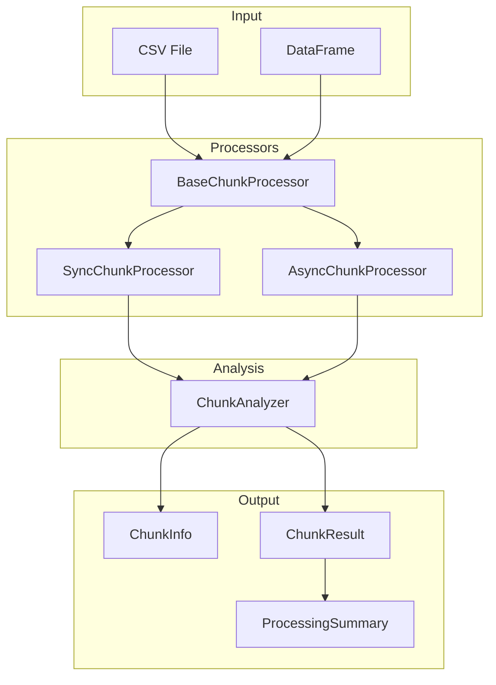

# Chunk Processing API Reference

The `clean.processing` module provides utilities for processing large datasets in chunks, enabling streaming analysis and memory-efficient processing.

## Overview

Chunk processing is useful when:
- Dataset doesn't fit in memory
- You need streaming/incremental processing
- Processing should yield results progressively
- Async/concurrent processing is required

## Architecture



## Data Classes

### ChunkInfo

Information about a data chunk.

```python
@dataclass
class ChunkInfo:
    """Information about a data chunk."""
    
    chunk_id: int      # Sequential chunk identifier
    start_row: int     # Starting row index (inclusive)
    end_row: int       # Ending row index (exclusive)
    n_rows: int        # Number of rows in chunk
    
    @classmethod
    def from_bounds(cls, chunk_id: int, start: int, end: int) -> ChunkInfo:
        """Create ChunkInfo from start/end bounds."""
```

**Example:**
```python
from clean.processing import ChunkInfo

info = ChunkInfo.from_bounds(chunk_id=0, start=0, end=1000)
print(info.n_rows)  # 1000
```

---

### ChunkResult

Result from processing a single chunk.

```python
@dataclass
class ChunkResult:
    """Result from processing a single chunk."""
    
    chunk_id: int                              # Chunk identifier
    start_row: int                             # Starting row
    end_row: int                               # Ending row
    issues: dict[str, list[int]] = field(default_factory=dict)  # Issue type -> indices
    quality_score: float = 100.0               # Quality score for this chunk
    stats: dict[str, Any] = field(default_factory=dict)  # Additional statistics
    
    @property
    def total_issues(self) -> int:
        """Total number of issues found in this chunk."""
        
    @property
    def n_rows(self) -> int:
        """Number of rows in this chunk."""
```

**Example:**
```python
from clean.processing import ChunkResult

result = ChunkResult(
    chunk_id=0,
    start_row=0,
    end_row=1000,
    issues={"outlier": [50, 100, 150], "duplicate": [200, 300]},
    quality_score=85.0,
)

print(result.total_issues)  # 5
print(result.n_rows)        # 1000
```

---

### ProcessingSummary

Summary of processing across all chunks.

```python
@dataclass
class ProcessingSummary:
    """Summary of processing across all chunks."""
    
    total_rows: int                            # Total rows processed
    total_chunks: int                          # Number of chunks
    total_issues: int                          # Total issues found
    issue_breakdown: dict[str, int] = field(default_factory=dict)
    average_quality_score: float = 100.0       # Average across chunks
    processing_time_seconds: float = 0.0       # Total processing time
    
    def to_dict(self) -> dict[str, Any]:
        """Convert summary to dictionary."""
    
    @classmethod
    def from_results(
        cls,
        results: list[ChunkResult],
        processing_time: float = 0.0,
    ) -> ProcessingSummary:
        """Create summary from list of chunk results."""
```

**Example:**
```python
from clean.processing import ProcessingSummary, ChunkResult

results = [
    ChunkResult(0, 0, 1000, issues={"outlier": [1, 2]}, quality_score=90.0),
    ChunkResult(1, 1000, 2000, issues={"outlier": [1050]}, quality_score=95.0),
]

summary = ProcessingSummary.from_results(results, processing_time=1.5)
print(summary.total_rows)         # 2000
print(summary.total_issues)       # 3
print(summary.average_quality_score)  # 92.5
```

---

## ChunkAnalyzer

Shared analysis logic for chunk processing.

```python
class ChunkAnalyzer:
    """Shared analysis logic for chunk processing."""
    
    def __init__(
        self,
        label_column: str | None = None,
        detectors: list[str] | None = None,
    ):
        """Initialize the analyzer.
        
        Args:
            label_column: Name of the label column
            detectors: List of detectors to run (default: ["duplicates", "outliers"])
        """
    
    def analyze_chunk(
        self,
        chunk: pd.DataFrame,
        chunk_info: ChunkInfo,
    ) -> ChunkResult:
        """Analyze a single chunk of data."""
```

**Available Detectors:**
- `"outliers"`: IQR-based outlier detection
- `"duplicates"`: Exact duplicate detection within chunk

**Example:**
```python
from clean.processing import ChunkAnalyzer, ChunkInfo
import pandas as pd

analyzer = ChunkAnalyzer(label_column="label", detectors=["outliers"])

chunk = pd.DataFrame({"feature": [1, 2, 3, 100], "label": ["a", "a", "b", "b"]})
info = ChunkInfo.from_bounds(0, 0, 4)

result = analyzer.analyze_chunk(chunk, info)
print(result.issues)  # {"outlier": [3]}  # Index 3 (value 100) is outlier
```

---

## SyncChunkProcessor

Synchronous chunk processor for simple use cases.

```python
class SyncChunkProcessor(BaseChunkProcessor[ChunkResult]):
    """Synchronous chunk processor."""
    
    def __init__(
        self,
        chunk_size: int = 10000,
        label_column: str | None = None,
        detectors: list[str] | None = None,
    ):
        """Initialize the processor.
        
        Args:
            chunk_size: Number of rows per chunk
            label_column: Name of the label column
            detectors: List of detectors to run
        """
    
    def process_dataframe(self, df: pd.DataFrame) -> Iterator[ChunkResult]:
        """Process a DataFrame in chunks."""
    
    def process_file(
        self, file_path: Path, **read_kwargs: Any
    ) -> Iterator[ChunkResult]:
        """Process a CSV file in chunks."""
    
    def reset(self) -> None:
        """Reset processor state for a new analysis."""
    
    def get_summary(self) -> ProcessingSummary:
        """Get summary of all processed chunks."""
```

**Example:**
```python
from clean.processing import SyncChunkProcessor
import pandas as pd

# Process DataFrame
processor = SyncChunkProcessor(chunk_size=1000, label_column="label")

df = pd.read_csv("large_file.csv")
for result in processor.process_dataframe(df):
    print(f"Chunk {result.chunk_id}: {result.total_issues} issues")

summary = processor.get_summary()
print(f"Total: {summary.total_issues} issues in {summary.total_rows} rows")
```

**Process file directly (memory efficient):**
```python
from pathlib import Path

processor = SyncChunkProcessor(chunk_size=50000)

for result in processor.process_file(Path("huge_dataset.csv")):
    print(f"Chunk {result.chunk_id}: {result.quality_score:.1f}% quality")
```

---

## AsyncChunkProcessor

Asynchronous chunk processor for non-blocking I/O.

```python
class AsyncChunkProcessor(BaseChunkProcessor[ChunkResult]):
    """Asynchronous chunk processor."""
    
    async def process_dataframe(
        self, df: pd.DataFrame
    ) -> AsyncIterator[ChunkResult]:
        """Process a DataFrame in chunks asynchronously."""
    
    async def process_file(
        self, file_path: Path, **read_kwargs: Any
    ) -> AsyncIterator[ChunkResult]:
        """Process a CSV file in chunks asynchronously."""
    
    def get_summary(self) -> ProcessingSummary:
        """Get summary of all processed chunks."""
```

**Example:**
```python
import asyncio
from clean.processing import AsyncChunkProcessor

async def analyze():
    processor = AsyncChunkProcessor(chunk_size=10000)
    
    async for result in processor.process_dataframe(df):
        print(f"Chunk {result.chunk_id}: {result.total_issues} issues")
        # Non-blocking - other tasks can run between chunks
    
    return processor.get_summary()

summary = asyncio.run(analyze())
```

**Concurrent processing:**
```python
async def analyze_multiple_files():
    processors = [
        AsyncChunkProcessor(chunk_size=10000),
        AsyncChunkProcessor(chunk_size=10000),
    ]
    
    files = [Path("file1.csv"), Path("file2.csv")]
    
    async def process_file(processor, path):
        async for result in processor.process_file(path):
            yield result
    
    # Process files concurrently
    tasks = [process_file(p, f) for p, f in zip(processors, files)]
    # ... handle concurrent iteration
```

---

## Usage Patterns

### Basic Streaming Analysis

```python
from clean.processing import SyncChunkProcessor

processor = SyncChunkProcessor(
    chunk_size=10000,
    label_column="target",
    detectors=["outliers", "duplicates"],
)

total_outliers = 0
for result in processor.process_dataframe(large_df):
    total_outliers += len(result.issues.get("outlier", []))
    
print(f"Found {total_outliers} outliers")
```

### Memory-Efficient File Processing

```python
from clean.processing import SyncChunkProcessor
from pathlib import Path

# Never loads entire file into memory
processor = SyncChunkProcessor(chunk_size=50000)

for result in processor.process_file(Path("10gb_dataset.csv")):
    if result.quality_score < 80:
        print(f"Low quality chunk: {result.chunk_id}")
```

### Progress Tracking

```python
from clean.processing import SyncChunkProcessor
from tqdm import tqdm

processor = SyncChunkProcessor(chunk_size=10000)

# Estimate chunks for progress bar
n_chunks = len(df) // 10000 + 1

results = []
for result in tqdm(processor.process_dataframe(df), total=n_chunks):
    results.append(result)

summary = processor.get_summary()
```

### Combining with Full Analysis

```python
from clean import DatasetCleaner
from clean.processing import SyncChunkProcessor

# Quick scan first
processor = SyncChunkProcessor(chunk_size=10000, detectors=["outliers"])
for result in processor.process_dataframe(df):
    if result.total_issues > 100:
        print(f"High issue count in rows {result.start_row}-{result.end_row}")

# Full analysis if needed
if processor.get_summary().average_quality_score < 90:
    cleaner = DatasetCleaner(data=df, label_column="label")
    report = cleaner.analyze()
```

---

## Performance Tips

1. **Choose appropriate chunk size**: Larger chunks are faster but use more memory. Start with 10,000-50,000 rows.

2. **Use file processing for huge datasets**: `process_file()` streams from disk, avoiding loading the entire file.

3. **Disable unused detectors**: Specify only needed detectors to reduce processing time.

4. **Use async for I/O-bound workflows**: `AsyncChunkProcessor` is beneficial when combined with other async operations.

```python
# Benchmark different chunk sizes
for size in [1000, 10000, 50000]:
    processor = SyncChunkProcessor(chunk_size=size)
    start = time.time()
    list(processor.process_dataframe(df))
    print(f"Chunk size {size}: {time.time() - start:.2f}s")
```
