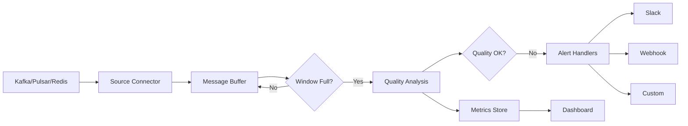

# Real-Time Streaming Pipeline

Process data quality checks on streaming data from Kafka, Pulsar, or Redis.

## Overview

The real-time module enables continuous data quality monitoring on streaming data sources. It supports multiple message brokers and provides alerting capabilities for quality degradation.

## RealtimePipeline

Main orchestrator for streaming data quality analysis.

::: clean.realtime.RealtimePipeline
    options:
      show_root_heading: true
      show_source: false
      members:
        - __init__
        - start
        - stop
        - add_alert_handler
        - get_metrics

### Example

```python
import asyncio
from clean.realtime import RealtimePipeline, KafkaSource, PipelineConfig

async def main():
    # Configure pipeline
    config = PipelineConfig(
        window_size=1000,
        quality_threshold=0.8,
        alert_on_degradation=True,
    )
    
    # Create Kafka source
    source = KafkaSource(
        bootstrap_servers="localhost:9092",
        topic="ml-data",
        group_id="quality-monitor",
    )
    
    # Initialize pipeline
    pipeline = RealtimePipeline(source=source, config=config)
    
    # Add alert handler
    pipeline.add_alert_handler(lambda alert: print(f"🚨 {alert}"))
    
    # Start processing
    await pipeline.start()

asyncio.run(main())
```

## Data Sources

### KafkaSource

Connect to Apache Kafka topics.

::: clean.realtime.KafkaSource
    options:
      show_root_heading: true
      show_source: false
      members:
        - __init__
        - connect
        - consume
        - close

```python
from clean.realtime import KafkaSource

source = KafkaSource(
    bootstrap_servers="localhost:9092",
    topic="training-data",
    group_id="clean-monitor",
    auto_offset_reset="latest",
)
```

### PulsarSource

Connect to Apache Pulsar topics.

::: clean.realtime.PulsarSource
    options:
      show_root_heading: true
      show_source: false
      members:
        - __init__
        - connect
        - consume
        - close

```python
from clean.realtime import PulsarSource

source = PulsarSource(
    service_url="pulsar://localhost:6650",
    topic="persistent://public/default/ml-data",
    subscription="quality-check",
)
```

### RedisSource

Connect to Redis Streams.

::: clean.realtime.RedisSource
    options:
      show_root_heading: true
      show_source: false
      members:
        - __init__
        - connect
        - consume
        - close

```python
from clean.realtime import RedisSource

source = RedisSource(
    host="localhost",
    port=6379,
    stream="ml:data:stream",
    consumer_group="quality-monitors",
)
```

## Configuration

### PipelineConfig

::: clean.realtime.PipelineConfig
    options:
      show_root_heading: true
      show_source: false

| Parameter | Type | Default | Description |
|-----------|------|---------|-------------|
| `window_size` | int | 1000 | Samples to collect before analysis |
| `quality_threshold` | float | 0.8 | Minimum acceptable quality score |
| `alert_on_degradation` | bool | True | Send alerts when quality drops |
| `detectors` | list | all | Which detectors to run |
| `batch_timeout` | float | 30.0 | Max seconds to wait for window |

## Alerting

### QualityAlert

::: clean.realtime.QualityAlert
    options:
      show_root_heading: true
      show_source: false

```python
from clean.realtime import SlackAlertHandler, WebhookAlertHandler

# Slack notifications
slack = SlackAlertHandler(webhook_url="https://hooks.slack.com/...")
pipeline.add_alert_handler(slack)

# Custom webhook
webhook = WebhookAlertHandler(url="https://api.example.com/alerts")
pipeline.add_alert_handler(webhook)
```

## Convenience Function

### create_realtime_pipeline

```python
from clean.realtime import create_realtime_pipeline

pipeline = create_realtime_pipeline(
    source_type="kafka",
    bootstrap_servers="localhost:9092",
    topic="ml-data",
    window_size=500,
)
```

## Architecture



## Installation

Requires optional `streaming` dependencies:

```bash
pip install clean-data-quality[streaming]
```

This installs:
- `aiokafka` - Kafka client
- `pulsar-client` - Pulsar client
- `redis` - Redis client
