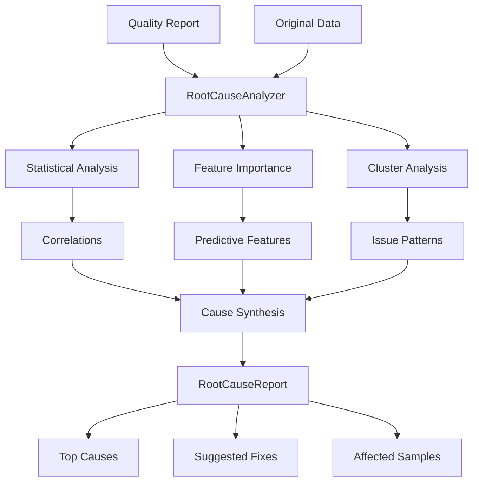

# Root Cause Analysis

Automatically identify the underlying causes of data quality issues.

## Overview

When quality issues are detected, understanding *why* they occur is critical for fixing them at the source. The root cause analysis module uses statistical analysis and machine learning to drill down into quality problems.

## RootCauseAnalyzer

Main class for automated root cause detection.

::: clean.root_cause.RootCauseAnalyzer
    options:
      show_root_heading: true
      show_source: false
      members:
        - __init__
        - analyze
        - get_top_causes
        - generate_report

### Example

```python
from clean.root_cause import RootCauseAnalyzer

# Initialize analyzer
analyzer = RootCauseAnalyzer(
    methods=["statistical", "feature_importance", "clustering"],
    max_causes=10,
)

# Analyze issues from a quality report
root_causes = analyzer.analyze(
    data=df,
    quality_report=report,
    issue_type="label_errors",
)

# View top causes
for cause in root_causes.top_causes[:5]:
    print(f"{cause.description}")
    print(f"  Impact: {cause.impact_score:.2f}")
    print(f"  Affected samples: {cause.affected_count}")
    print(f"  Suggestion: {cause.suggested_fix}")
```

## Analysis Methods

### Statistical Analysis

Identifies correlations between features and quality issues.

```python
from clean.root_cause import StatisticalAnalyzer

analyzer = StatisticalAnalyzer()
results = analyzer.analyze(
    data=df,
    issue_mask=label_errors_mask,
)

# Results show which features correlate with issues
for feature, stats in results.correlations.items():
    if stats.p_value < 0.05:
        print(f"{feature}: correlation={stats.correlation:.3f}")
```

### Feature Importance Analysis

Uses ML models to identify features that predict quality issues.

```python
from clean.root_cause import FeatureImportanceAnalyzer

analyzer = FeatureImportanceAnalyzer(model="random_forest")
results = analyzer.analyze(
    data=df,
    issue_mask=outliers_mask,
)

# View feature importances
for feature, importance in results.importances.items():
    print(f"{feature}: {importance:.3f}")
```

### Cluster Analysis

Groups issues to find common patterns.

```python
from clean.root_cause import ClusterAnalyzer

analyzer = ClusterAnalyzer(n_clusters="auto")
results = analyzer.analyze(
    data=df,
    issue_mask=duplicates_mask,
)

# View issue clusters
for cluster in results.clusters:
    print(f"Cluster {cluster.id}: {cluster.size} samples")
    print(f"  Common traits: {cluster.common_features}")
```

## RootCause

Represents an identified cause of quality issues.

::: clean.root_cause.RootCause
    options:
      show_root_heading: true
      show_source: false

| Attribute | Type | Description |
|-----------|------|-------------|
| `description` | str | Human-readable cause description |
| `cause_type` | str | Category: "feature", "pattern", "source", "process" |
| `impact_score` | float | 0-1 score of how much this explains issues |
| `affected_count` | int | Number of samples affected |
| `affected_indices` | list | Indices of affected samples |
| `suggested_fix` | str | Recommended remediation |
| `confidence` | float | Confidence in this cause |

## RootCauseReport

Full analysis results.

::: clean.root_cause.RootCauseReport
    options:
      show_root_heading: true
      show_source: false

```python
report = analyzer.analyze(data, quality_report, "label_errors")

# Summary
print(f"Total issues analyzed: {report.total_issues}")
print(f"Causes identified: {len(report.causes)}")
print(f"Coverage: {report.explained_fraction:.1%}")

# Export
report.to_json("root_causes.json")
report.to_html("root_causes.html")
```

## Convenience Function

### analyze_root_causes

```python
from clean.root_cause import analyze_root_causes

causes = analyze_root_causes(
    data=df,
    issue_indices=label_error_indices,
    methods=["statistical", "feature_importance"],
    max_causes=5,
)

for cause in causes:
    print(f"- {cause.description} (impact: {cause.impact_score:.2f})")
```

## Common Root Causes

The analyzer can identify several types of root causes:

| Cause Type | Example | Suggested Fix |
|------------|---------|---------------|
| **Feature-based** | "High values in 'price' correlate with label errors" | Review labeling for high-price items |
| **Source-based** | "80% of issues from source 'vendor_A'" | Audit vendor_A data pipeline |
| **Temporal** | "Issues spike on weekends" | Check weekend data collection process |
| **Pattern** | "Duplicate patterns in text fields" | Deduplicate before labeling |
| **Annotator** | "Annotator X has 3x error rate" | Retrain or remove annotator |

## Architecture



## Integration Example

```python
from clean import DatasetCleaner
from clean.root_cause import RootCauseAnalyzer

# Run quality analysis
cleaner = DatasetCleaner(data=df, label_column="label")
report = cleaner.analyze()

# If significant issues found, analyze root causes
if report.label_errors().shape[0] > 100:
    analyzer = RootCauseAnalyzer()
    causes = analyzer.analyze(df, report, "label_errors")
    
    print("Root causes of label errors:")
    for cause in causes.top_causes[:3]:
        print(f"  • {cause.description}")
        print(f"    Fix: {cause.suggested_fix}")
```
