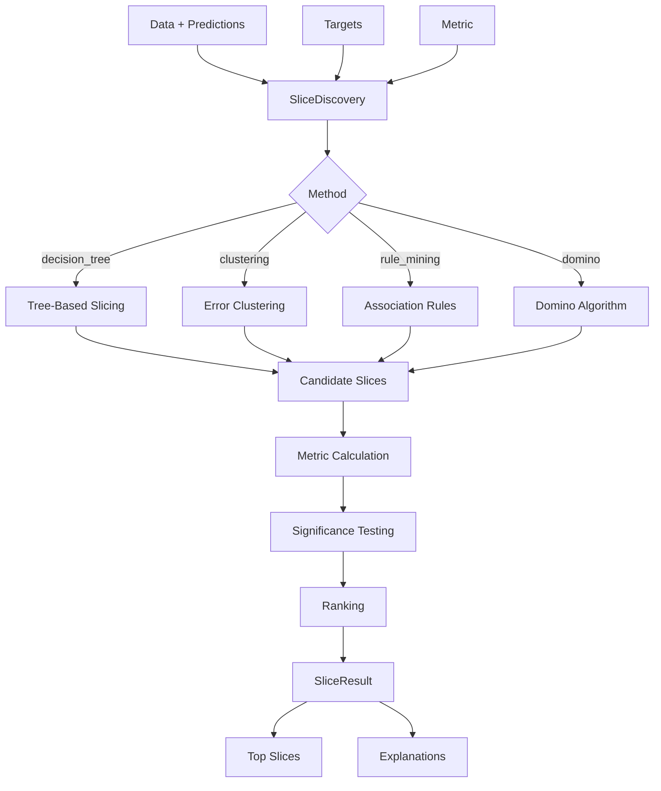

# Data Slice Discovery

Automatically identify underperforming data subgroups.

## Overview

ML models often perform well on average but fail on specific data slices. The slice discovery module automatically finds subgroups where your model (or data quality) degrades, helping you identify blind spots and biases.

## SliceDiscovery

Main class for automatic slice identification.

::: clean.slice_discovery.SliceDiscoverer
    options:
      show_root_heading: true
      show_source: false
      members:
        - __init__
        - discover
        - get_top_slices

### Example

```python
from clean.slice_discovery import SliceDiscoverer

# Initialize discoverer
discoverer = SliceDiscoverer(
    method="decision_tree",
    min_slice_size=50,
    max_slices=20,
)

# Discover problematic slices
result = discoverer.discover(
    X=df,
    y=y_true,
    predictions=y_pred,
)

# View discovered slices
for slice in result.top_slices[:5]:
    print(f"Slice: {slice.description}")
    print(f"  Size: {slice.size} samples ({slice.fraction:.1%})")
    print(f"  Metric: {slice.metric_value:.3f} (overall: {result.overall_metric:.3f})")
    print(f"  Gap: {slice.gap:+.3f}")
```

## Discovery Methods

### Decision Tree Slicing

Uses decision trees to find feature combinations that predict errors.

```python
discoverer = SliceDiscovery(
    method="decision_tree",
    max_depth=4,
    min_samples_leaf=50,
)
```

### Clustering-Based

Groups errors and finds common characteristics.

```python
discoverer = SliceDiscovery(
    method="clustering",
    n_clusters="auto",
    cluster_method="hdbscan",
)
```

### Rule Mining

Discovers interpretable rules that define slices.

```python
discoverer = SliceDiscovery(
    method="rule_mining",
    max_rules=100,
    min_support=0.01,
)
```

### Domino Slicing

State-of-the-art slice discovery algorithm.

```python
discoverer = SliceDiscovery(
    method="domino",
    representation="embeddings",
    similarity_threshold=0.8,
)
```

## Slice

Represents a discovered data slice.

::: clean.slice_discovery.DataSlice
    options:
      show_root_heading: true
      show_source: false

| Attribute | Type | Description |
|-----------|------|-------------|
| `description` | str | Human-readable slice definition |
| `conditions` | list | Feature conditions defining the slice |
| `indices` | ndarray | Indices of samples in this slice |
| `size` | int | Number of samples |
| `error_rate` | float | Error rate on this slice |

## SliceDiscoveryReport

::: clean.slice_discovery.SliceDiscoveryReport
    options:
      show_root_heading: true
      show_source: false

```python
result = discoverer.discover(X=data, y=targets, predictions=predictions)

# Summary
print(f"Total slices found: {len(result.slices)}")

# Get top problematic slices
for slice in result.slices[:5]:
    print(f"Slice: {slice.description}, Error rate: {slice.error_rate:.3f}")
```

## Metrics

Supported performance metrics for slice discovery:

| Metric | Best For | Description |
|--------|----------|-------------|
| `accuracy` | Classification | Correct predictions / total |
| `f1` | Classification | Harmonic mean of precision/recall |
| `precision` | Classification | True positives / predicted positives |
| `recall` | Classification | True positives / actual positives |
| `mse` | Regression | Mean squared error |
| `mae` | Regression | Mean absolute error |
| `quality_score` | Data quality | Clean's quality score |

## Slice Explanation

Get detailed explanations for why a slice underperforms:

```python
explanation = discoverer.explain_slice(
    slice=worst_slice,
    data=df,
    predictions=y_pred,
    targets=y_true,
)

print(f"Slice: {worst_slice.description}")
print(f"\nTop contributing factors:")
for factor in explanation.factors[:3]:
    print(f"  • {factor.description}: {factor.contribution:.1%}")

print(f"\nExample misclassifications:")
for example in explanation.examples[:3]:
    print(f"  • Pred: {example.prediction}, True: {example.target}")
```

## Integration with Clean

### Find Quality Issue Slices

```python
from clean import DatasetCleaner
from clean.slice_discovery import SliceDiscovery

# Run quality analysis
cleaner = DatasetCleaner(data=df, label_column="label")
report = cleaner.analyze()

# Discover slices with high label error rates
discoverer = SliceDiscovery(method="decision_tree")
slices = discoverer.discover(
    data=df,
    predictions=report.label_errors().index,  # Error indicators
    targets=None,
    metric="error_rate",
)

print("Data slices with high label error rates:")
for slice in slices.top_slices[:3]:
    print(f"  {slice.description}: {slice.metric_value:.1%} errors")
```

### Slice-Aware Quality Scoring

```python
from clean.slice_discovery import SliceAwareScorer

scorer = SliceAwareScorer(
    min_slice_quality=0.7,
    max_slice_gap=0.2,
)

result = scorer.score(data=df, quality_report=report)

print(f"Overall score: {result.overall_score:.1f}")
print(f"Worst slice score: {result.min_slice_score:.1f}")
print(f"Slice-adjusted score: {result.adjusted_score:.1f}")
```

## Convenience Function

### discover_slices

```python
from clean.slice_discovery import discover_slices

slices = discover_slices(
    data=df,
    predictions=y_pred,
    targets=y_true,
    metric="accuracy",
    method="decision_tree",
    top_k=10,
)

for slice in slices:
    print(f"{slice.description}: {slice.metric_value:.3f}")
```

## Architecture



## Visualization

```python
from clean.slice_discovery import plot_slice_comparison

# Compare top slices
plot_slice_comparison(
    result.top_slices[:10],
    overall_metric=result.overall_metric,
    title="Underperforming Data Slices",
)

# Slice feature distributions
plot_slice_distributions(
    worst_slice,
    data=df,
    feature_columns=["age", "income", "region"],
)
```

## Best Practices

1. **Set appropriate minimum slice size**: Too small = noise, too large = misses issues
2. **Use multiple methods**: Different methods find different slice types
3. **Validate discovered slices**: Confirm on held-out data
4. **Prioritize by size × gap**: Large, underperforming slices are most important
5. **Act on findings**: Collect more data, improve labels, or add features for problem slices
