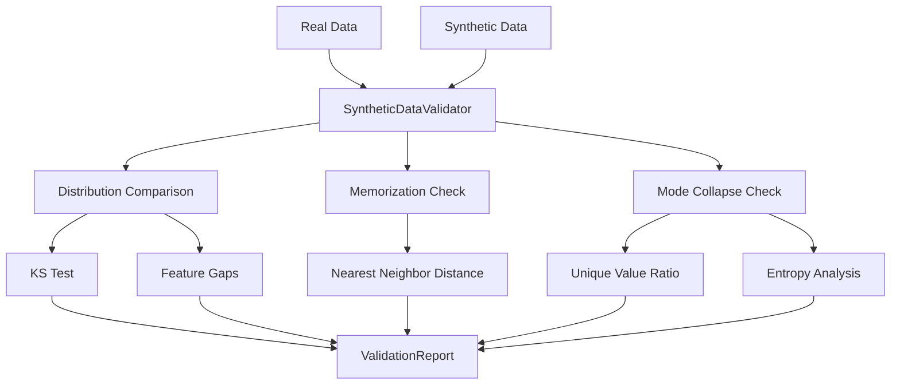

# Synthetic Data Validation

Validate quality of synthetically generated datasets.

## Overview

Synthetic data generators can produce data with subtle issues: mode collapse, memorization of training examples, or distribution gaps. Clean provides tools to detect these problems before they impact downstream models.

## SyntheticDataValidator

Validates synthetic data against real reference data.

::: clean.synthetic.SyntheticDataValidator
    options:
      show_root_heading: true
      show_source: false
      members:
        - __init__
        - validate
        - check_memorization
        - check_mode_collapse

### Example

```python
from clean import SyntheticDataValidator

validator = SyntheticDataValidator(
    memorization_threshold=0.1,  # Max similarity to real samples
    mode_collapse_threshold=0.3,  # Min diversity threshold
)

report = validator.validate(
    real_data=original_df,
    synthetic_data=generated_df,
    feature_columns=["age", "income", "score"],
)

print(f"Quality Score: {report.quality_score:.1f}/100")
print(f"Fidelity Score: {report.fidelity_score:.1f}/100")
print(f"")
print(f"Issues:")
print(f"  Mode Collapse: {report.has_mode_collapse}")
print(f"  Memorization Risk: {report.memorization_risk:.2%}")
print(f"  Distribution Gap: {report.distribution_gap:.3f}")
```

## SyntheticValidationReport

Results from synthetic data validation.

::: clean.synthetic.SyntheticValidationReport
    options:
      show_root_heading: true
      show_source: false
      members:
        - summary
        - to_dict
        - get_memorized_samples
        - get_collapsed_features

### Investigating Issues

```python
# Get potentially memorized samples
memorized = report.get_memorized_samples(threshold=0.05)
for idx, similarity in memorized.items():
    print(f"Sample {idx}: {similarity:.1%} similar to training data")

# Get features with mode collapse
collapsed = report.get_collapsed_features()
for feature, info in collapsed.items():
    print(f"{feature}: only {info['unique_ratio']:.1%} unique values")
```

## Convenience Function

### validate_synthetic_data

```python
from clean import validate_synthetic_data

report = validate_synthetic_data(
    real_data=original_df,
    synthetic_data=generated_df,
    feature_columns=None,  # Auto-detect
)

if report.quality_score < 80:
    print("⚠ Synthetic data quality issues detected")
```

## Issue Types

### Mode Collapse

When the generator produces limited variety:

```python
# Check for mode collapse
if report.has_mode_collapse:
    collapsed = report.get_collapsed_features()
    print("Features with low diversity:")
    for feature, info in collapsed.items():
        print(f"  {feature}: {info['n_unique']} unique values")
        print(f"    Most common: {info['mode']} ({info['mode_frequency']:.1%})")
```

### Memorization

When synthetic samples are too similar to real training data:

```python
# Check memorization risk
if report.memorization_risk > 0.05:
    memorized = report.get_memorized_samples()
    print(f"Found {len(memorized)} potentially memorized samples")
    
    # These samples should be removed or the generator retrained
```

### Distribution Gap

When synthetic distribution doesn't match real data:

```python
# Per-feature distribution comparison
for feature, gap in report.feature_gaps.items():
    if gap > 0.1:
        print(f"⚠ {feature}: distribution gap = {gap:.3f}")
```

## Metrics Explained

| Metric | Range | Description |
|--------|-------|-------------|
| Quality Score | 0-100 | Overall synthetic data quality |
| Fidelity Score | 0-100 | How well synthetic matches real distribution |
| Memorization Risk | 0-1 | Fraction of samples too similar to training |
| Distribution Gap | 0-∞ | Statistical distance between distributions |

## Architecture



## Best Practices

1. **Validate before use**: Always validate synthetic data before training models
2. **Check per-feature**: Some features may be fine while others have issues
3. **Tune thresholds**: Acceptable memorization depends on use case
4. **Iterative improvement**: Use validation feedback to improve generators
