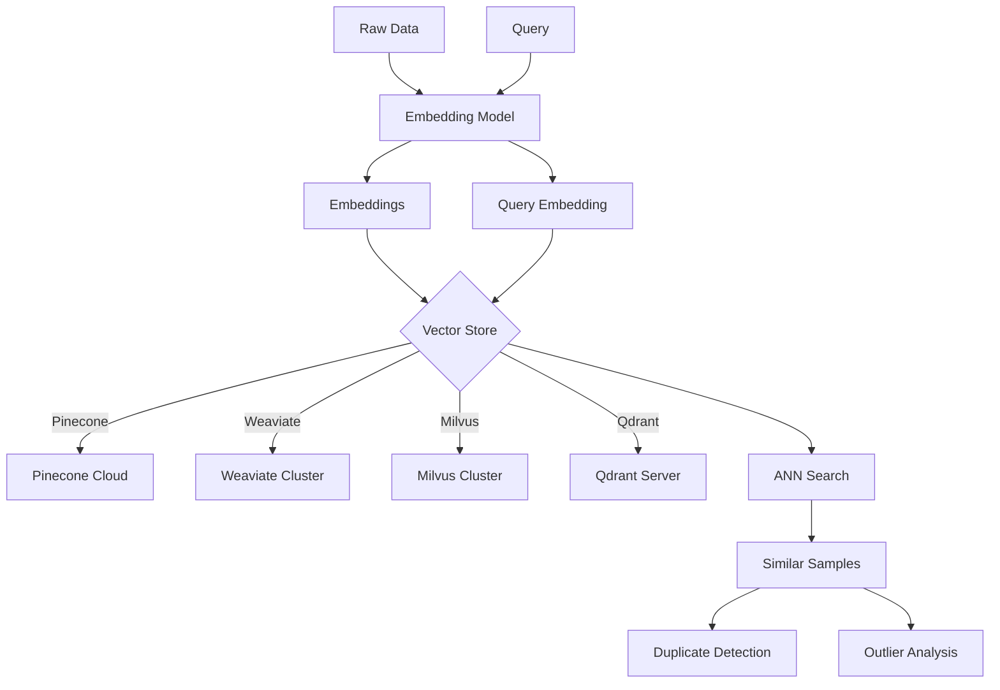

# Vector Database Integration

Connect Clean to vector databases for efficient similarity search on large datasets.

## Overview

The vector database module enables Clean to leverage specialized vector stores for near-duplicate detection and similarity analysis at scale. This is essential for datasets with millions of samples where in-memory comparison isn't feasible.

## Supported Backends

| Backend | Best For | Managed Service |
|---------|----------|-----------------|
| **Pinecone** | Serverless, easy setup | Yes |
| **Weaviate** | Hybrid search, GraphQL | Yes/Self-hosted |
| **Milvus** | High performance, on-prem | Self-hosted |
| **Qdrant** | Filtering, payloads | Yes/Self-hosted |

## VectorStore

Abstract base class for vector store connections.

::: clean.vectordb.VectorStore
    options:
      show_root_heading: true
      show_source: false
      members:
        - connect
        - add
        - search
        - delete

## Pinecone

### PineconeStore

::: clean.vectordb.PineconeStore
    options:
      show_root_heading: true
      show_source: false

```python
from clean.vectordb import PineconeStore

# Connect to Pinecone
store = PineconeStore(
    api_key="your-api-key",
    environment="us-west1-gcp",
    index_name="clean-embeddings",
)

# Add embeddings
store.add(
    ids=sample_ids,
    embeddings=embeddings,
    metadata=[{"source": "training_v1"}] * len(sample_ids),
)

# Search for similar vectors
results = store.search(
    query_embedding=query_embedding,
    k=10,
)
```

## Weaviate

### WeaviateStore

::: clean.vectordb.WeaviateStore
    options:
      show_root_heading: true
      show_source: false

```python
from clean.vectordb import WeaviateStore

# Connect to Weaviate
store = WeaviateStore(
    url="http://localhost:8080",
    api_key=None,  # Optional for self-hosted
    class_name="DataSample",
)

# Index with properties
connector.index(
    embeddings=embeddings,
    ids=sample_ids,
    properties={
        "label": labels,
        "source": sources,
    },
)

# Hybrid search (vector + keyword)
results = connector.search(
    query_vector=query_embedding,
    top_k=10,
    filters={"label": "positive"},
)
```

## Milvus

### MilvusStore

::: clean.vectordb.MilvusStore
    options:
      show_root_heading: true
      show_source: false

```python
from clean.vectordb import MilvusStore

# Connect to Milvus
store = MilvusStore(
    host="localhost",
    port=19530,
    collection_name="clean_embeddings",
)

# Add embeddings
store.add(
    ids=sample_ids,
    embeddings=embeddings,
)

# Search
results = store.search(
    query_embedding=query_embedding,
    k=10,
)
```

## Qdrant

### QdrantStore

::: clean.vectordb.QdrantStore
    options:
      show_root_heading: true
      show_source: false

```python
from clean.vectordb import QdrantStore

# Connect to Qdrant
store = QdrantStore(
    url="http://localhost:6333",
    collection_name="clean_samples",
)

# Add with metadata
store.add(
    ids=sample_ids,
    embeddings=embeddings,
    metadata=[
        {"label": label, "confidence": conf}
        for label, conf in zip(labels, confidences)
    ],
)

# Search with payload filter
results = connector.search(
    query_vector=query_embedding,
    top_k=10,
    filter={
        "must": [
            {"key": "confidence", "range": {"gte": 0.8}}
        ]
    },
)
```

## Integration with Clean

### Duplicate Detection at Scale

```python
from clean import DatasetCleaner
from clean.vectordb import PineconeConnector

# Setup vector store
connector = PineconeConnector(
    api_key="...",
    index_name="dataset-embeddings",
)

# Use with cleaner
cleaner = DatasetCleaner(
    data=df,
    label_column="label",
    vector_store=connector,  # Enable vector-based duplicate detection
)

# Run analysis - duplicates use vector DB
report = cleaner.analyze()
duplicates = report.duplicates()  # Found via approximate nearest neighbors
```

### Embedding Generation

```python
from clean.vectordb import generate_embeddings

# Generate embeddings for your data
embeddings = generate_embeddings(
    data=df,
    text_column="text",
    model="sentence-transformers/all-MiniLM-L6-v2",
)

# Index in vector store
connector.index(embeddings=embeddings, ids=df.index.tolist())
```

## SearchResult

::: clean.vectordb.SearchResult
    options:
      show_root_heading: true
      show_source: false

| Attribute | Type | Description |
|-----------|------|-------------|
| `id` | str | ID of matched vector |
| `score` | float | Similarity score |
| `metadata` | dict | Associated metadata |

## Convenience Function

### create_vector_store

```python
from clean.vectordb import create_vector_store

# Factory function for any backend
store = create_vector_store(
    backend="pinecone",  # pinecone, weaviate, milvus, qdrant, memory
    api_key="...",
    index_name="my-index",
)
```

## Architecture



## Installation

Requires optional `vectordb` dependencies:

```bash
pip install clean-data-quality[vectordb]
```

This installs:
- `pinecone-client` - Pinecone SDK
- `weaviate-client` - Weaviate SDK
- `pymilvus` - Milvus SDK
- `qdrant-client` - Qdrant SDK

## Performance Tips

1. **Batch operations**: Index/search in batches of 100-1000
2. **Choose the right metric**: Cosine for normalized embeddings, L2 for raw
3. **Use filters**: Reduce search space with metadata filters
4. **Index tuning**: Configure index parameters for your scale
5. **Caching**: Cache frequently searched vectors locally
