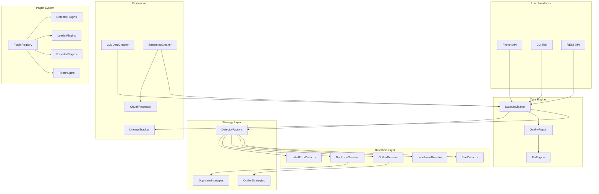
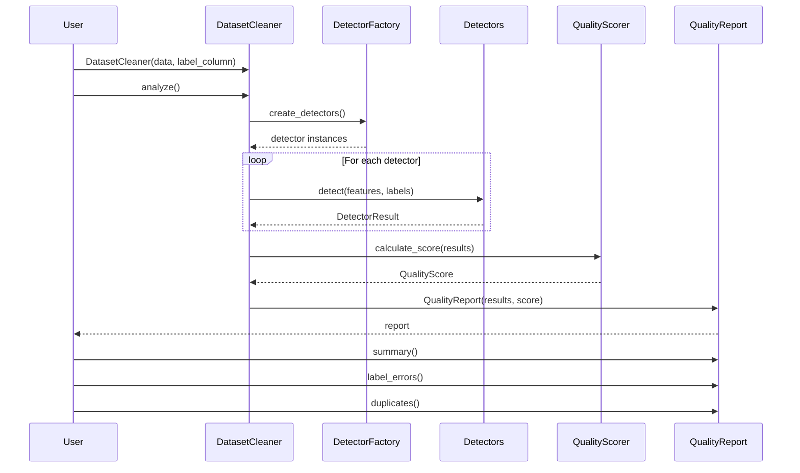
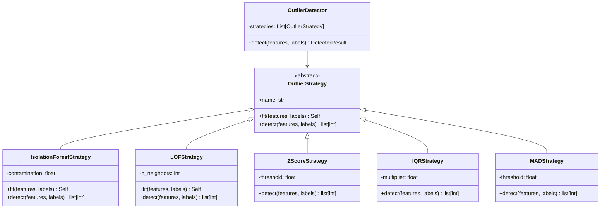
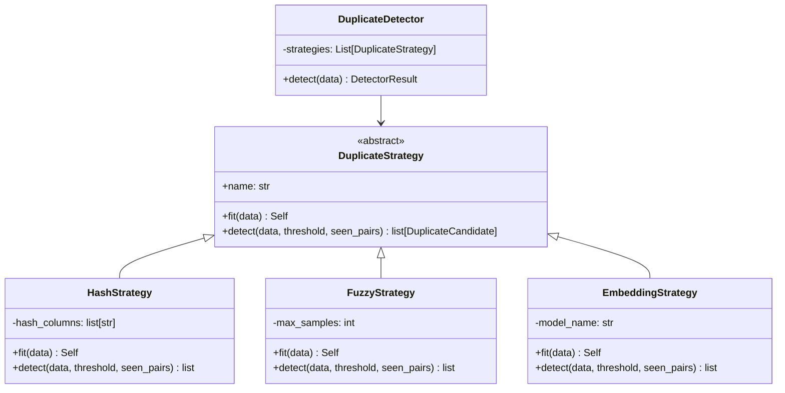
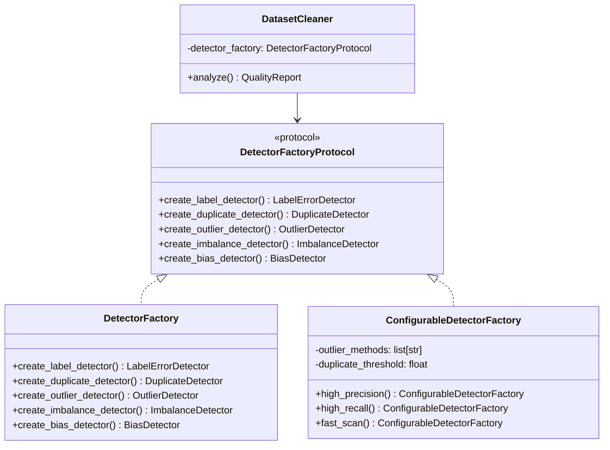
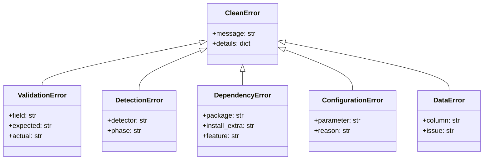
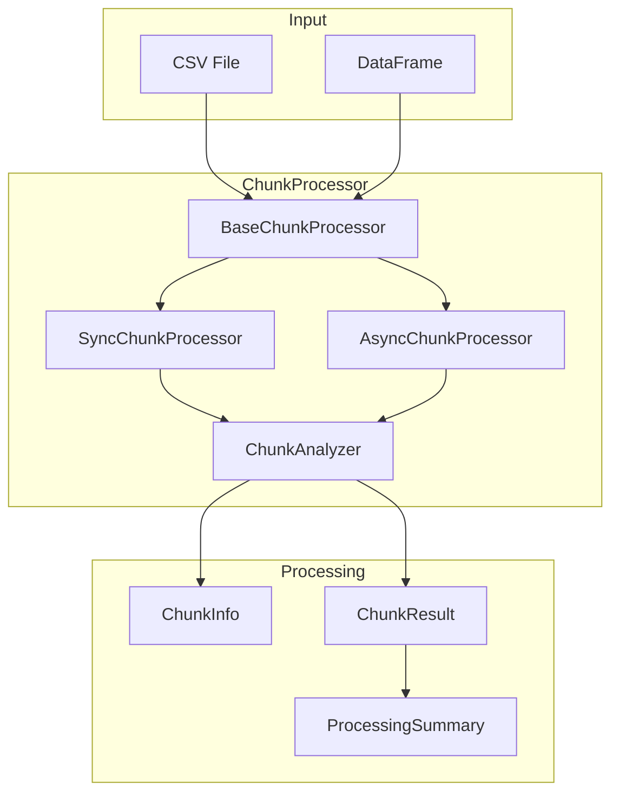
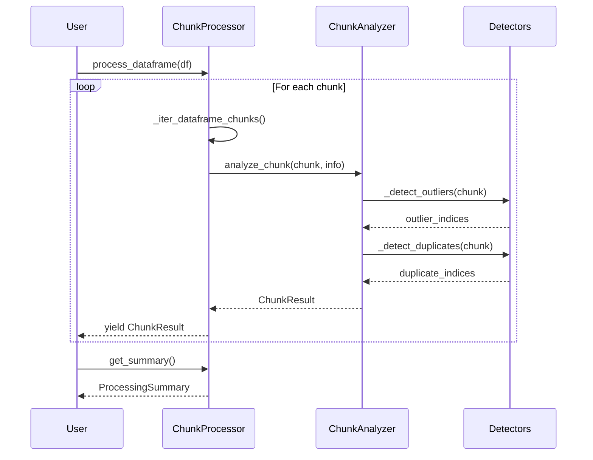
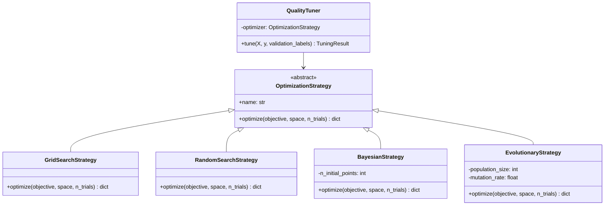

# Architecture Overview

This document describes the architecture and design of the Clean data quality platform.

## System Overview

Clean is designed as a modular, extensible platform with clear separation of concerns:



## Core Components

### DatasetCleaner

The main entry point for data quality analysis. Orchestrates detection, scoring, and reporting.



### Detection Pipeline with Strategy Pattern

Each detector uses the Strategy pattern for flexible algorithm selection:



### Duplicate Detection Strategies



### Dependency Injection with DetectorFactory



## Exception Hierarchy

Clean uses a domain-specific exception hierarchy:



## Chunk Processing Architecture

For large datasets, Clean provides streaming/chunked processing:





## AutoML Optimization Architecture

The QualityTuner uses pluggable optimization strategies:



## Module Structure

```
src/clean/
├── __init__.py              # Public API exports
├── __version__.py           # Version info
├── exceptions.py            # Domain exception hierarchy
├── constants.py             # Configuration constants
│
├── core/                    # Core functionality
│   ├── cleaner.py           # DatasetCleaner (with DI support)
│   ├── report.py            # QualityReport
│   └── types.py             # Type definitions, DetectionResults
│
├── detection/               # Issue detectors
│   ├── base.py              # BaseDetector, DetectorResult
│   ├── label_errors.py      # LabelErrorDetector
│   ├── duplicates.py        # DuplicateDetector
│   ├── outliers.py          # OutlierDetector
│   ├── imbalance.py         # ImbalanceDetector
│   ├── bias.py              # BiasDetector
│   ├── strategies.py        # Outlier detection strategies (NEW)
│   ├── duplicate_strategies.py  # Duplicate detection strategies (NEW)
│   └── factory.py           # DetectorFactory for DI (NEW)
│
├── automl/                  # AutoML package (NEW)
│   ├── __init__.py          # Package exports
│   ├── optimizers.py        # Optimization strategies
│   └── tuner.py             # Refactored QualityTuner
│
├── processing/              # Chunk processing (NEW)
│   └── __init__.py          # ChunkProcessor classes
│
├── loaders/                 # Data loaders
│   ├── base.py              # BaseLoader
│   ├── pandas_loader.py     # DataFrame loading
│   ├── csv_loader.py        # CSV file loading
│   ├── huggingface_loader.py
│   └── image_loader.py
│
├── scoring/                 # Quality scoring
│   ├── quality_scorer.py    # Accepts DetectionResults
│   └── metrics.py
│
├── visualization/           # Plots and browsers
│   ├── plots.py             # Matplotlib plots
│   ├── interactive.py       # Plotly plots
│   └── browser.py           # Issue browser widget
│
├── fixes.py                 # Auto-fix engine
├── plugins.py               # Plugin registry
├── lineage.py               # Data lineage tracking
├── llm.py                   # LLM data quality
├── streaming.py             # Streaming analysis
├── api.py                   # REST API (FastAPI)
└── cli.py                   # Command-line interface
```

## Key Design Decisions

### 1. Strategy Pattern for Detection Algorithms

Detection algorithms are encapsulated in strategy classes, enabling:
- Independent testing of each algorithm
- Easy addition of new algorithms without modifying detectors
- Runtime algorithm selection
- Reduced cyclomatic complexity

```python
# Create strategy directly
strategy = create_strategy("isolation_forest", contamination=0.05)
outliers = strategy.fit(features, labels).detect(features, labels)

# Or via detector with multiple strategies
detector = OutlierDetector(methods=["zscore", "isolation_forest"])
result = detector.fit_detect(features, labels)
```

### 2. Dependency Injection for Testability

The `DetectorFactory` pattern enables:
- Easy mocking in unit tests
- Custom detector configurations
- Preset configurations (high_precision, fast_scan)

```python
# Use custom factory
factory = ConfigurableDetectorFactory.high_precision()
cleaner = DatasetCleaner(data=df, detector_factory=factory)

# Or inject mock for testing
mock_factory = MockDetectorFactory()
cleaner = DatasetCleaner(data=df, detector_factory=mock_factory)
```

### 3. Domain Exception Hierarchy

All exceptions inherit from `CleanError`, providing:
- Consistent error handling
- Detailed error information via `details` dict
- Clear installation instructions for optional dependencies

```python
try:
    embedder = TextEmbedder()
except DependencyError as e:
    print(f"Install: {e.install_command}")
    # Output: Install: pip install clean-data-quality[text]
```

### 4. Parameter Objects for Complex APIs

The `DetectionResults` dataclass aggregates detector outputs:

```python
@dataclass
class DetectionResults:
    label_errors: DetectorResult | None
    duplicates: DetectorResult | None
    outliers: DetectorResult | None
    imbalance: DetectorResult | None
    bias: DetectorResult | None
    
# Simplifies API from 9 parameters to 4
def compute_score(n_samples, results: DetectionResults, labels=None, features=None):
    ...
```

### 5. Lazy Loading of Optional Dependencies

Heavy dependencies are lazily imported with helpful error messages:

```python
try:
    from sentence_transformers import SentenceTransformer
    HAS_SENTENCE_TRANSFORMERS = True
except ImportError:
    HAS_SENTENCE_TRANSFORMERS = False

def get_embeddings(texts):
    if not HAS_SENTENCE_TRANSFORMERS:
        raise DependencyError(
            "sentence-transformers", 
            install_extra="text",
            feature="text embeddings"
        )
    ...
```

## Performance Benchmarks

Strategy pattern overhead is negligible:

| Component | Performance |
|-----------|-------------|
| Strategy factory creation | 0.31 µs/call |
| Z-Score detection | 11M samples/sec |
| LOF detection | 20K samples/sec |
| Hash duplicate detection | 40K samples/sec |
| Chunk processing (2K/chunk) | 368K samples/sec |

## Security Considerations

- **No Eval**: User data is never passed to `eval()` or similar
- **Sandboxed Plugins**: Plugins are validated before registration
- **API Authentication**: REST API supports standard auth middleware
- **Data Privacy**: No data is transmitted externally
- **Exception Safety**: Error messages don't leak sensitive data

## Future Considerations

1. **GPU Acceleration**: cuDF support for faster DataFrame operations
2. **Distributed Processing**: Enhanced Dask/Spark integration
3. **Parallel Detection**: Concurrent detector execution
4. **Caching Layer**: Redis-based caching for expensive computations
