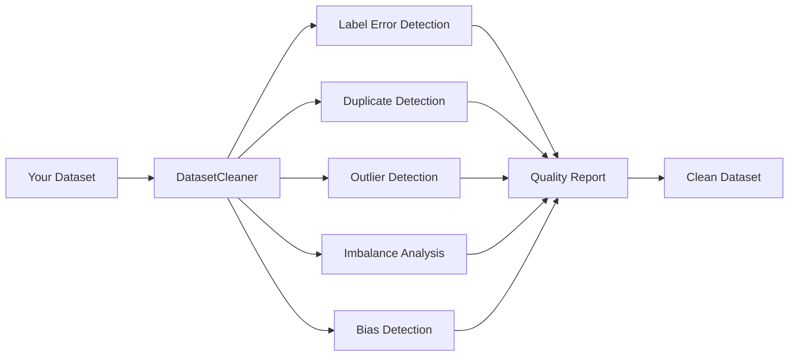

# User Guide Overview

This guide provides detailed information about Clean's features and how to use them effectively.

## How Clean Works

Clean analyzes your dataset using multiple detection methods:



## Detection Methods

### Label Error Detection

Uses **confident learning** to identify samples where the given label likely differs from the true label. This works by:

1. Training a classifier on your data with cross-validation
2. Estimating the noise transition matrix
3. Identifying samples with low self-confidence

[Learn more →](label-errors.md)

### Duplicate Detection

Finds duplicates using two methods:

1. **Exact duplicates**: Hash-based detection
2. **Near-duplicates**: Embedding similarity

[Learn more →](duplicates.md)

### Outlier Detection

Identifies anomalies using an ensemble of methods:

- Isolation Forest
- Local Outlier Factor (LOF)
- Statistical methods (z-score, IQR)

[Learn more →](outliers.md)

### Class Imbalance

Analyzes class distribution and identifies:

- Highly imbalanced classes
- Minority classes that may need oversampling
- Majority classes that may need undersampling

[Learn more →](imbalance.md)

### Bias Detection

Checks for fairness issues across sensitive features:

- Demographic parity
- Representation bias
- Feature correlations

[Learn more →](bias.md)

## Quality Scoring

Clean provides a comprehensive quality score:

| Component | What it Measures |
|-----------|------------------|
| Label Quality | Percentage of clean labels |
| Duplicate Quality | Ratio of unique samples |
| Outlier Quality | Ratio of non-anomalous samples |
| Balance Quality | Class distribution evenness |
| **Overall** | Weighted combination |

[Learn more →](reports.md)

## Typical Workflow

1. **Load your data**
   ```python
   cleaner = DatasetCleaner(data=df, label_column='label')
   ```

2. **Run analysis**
   ```python
   report = cleaner.analyze()
   ```

3. **Review issues**
   ```python
   print(report.summary())
   review_queue = cleaner.get_review_queue()
   ```

4. **Get clean data**
   ```python
   clean_df = cleaner.get_clean_data()
   ```

5. **Export reports**
   ```python
   report.save_html('report.html')
   ```

## Next Steps

- [Label Error Detection](label-errors.md) - Deep dive into finding mislabeled data
- [Quality Reports](reports.md) - Understanding your quality scores
- [Visualization](visualization.md) - Interactive exploration of issues
