# Next-Gen Features Architecture

This document provides an architectural overview of Clean's next-generation features, their interactions, and data flows.

## System Overview

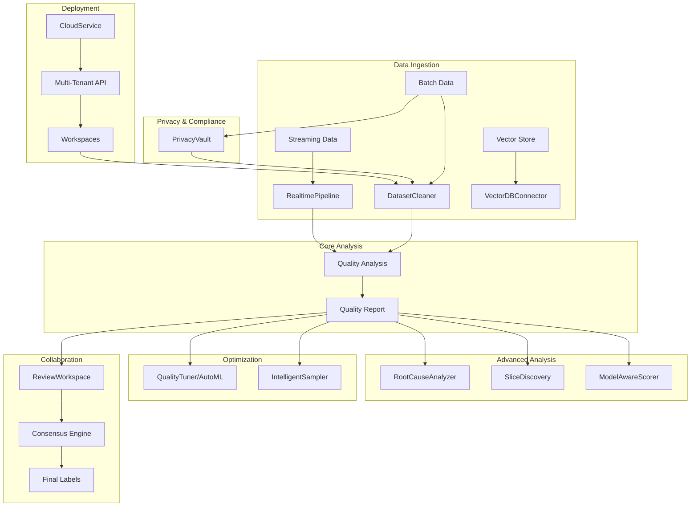

## Feature Interactions

### 1. Real-Time Pipeline

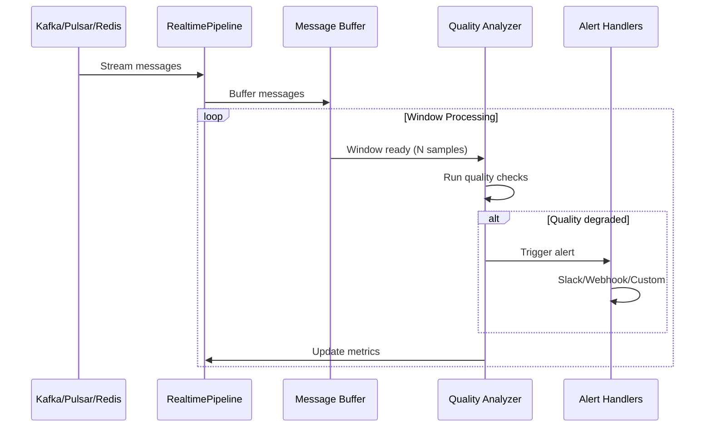

### 2. AutoML Tuning Flow

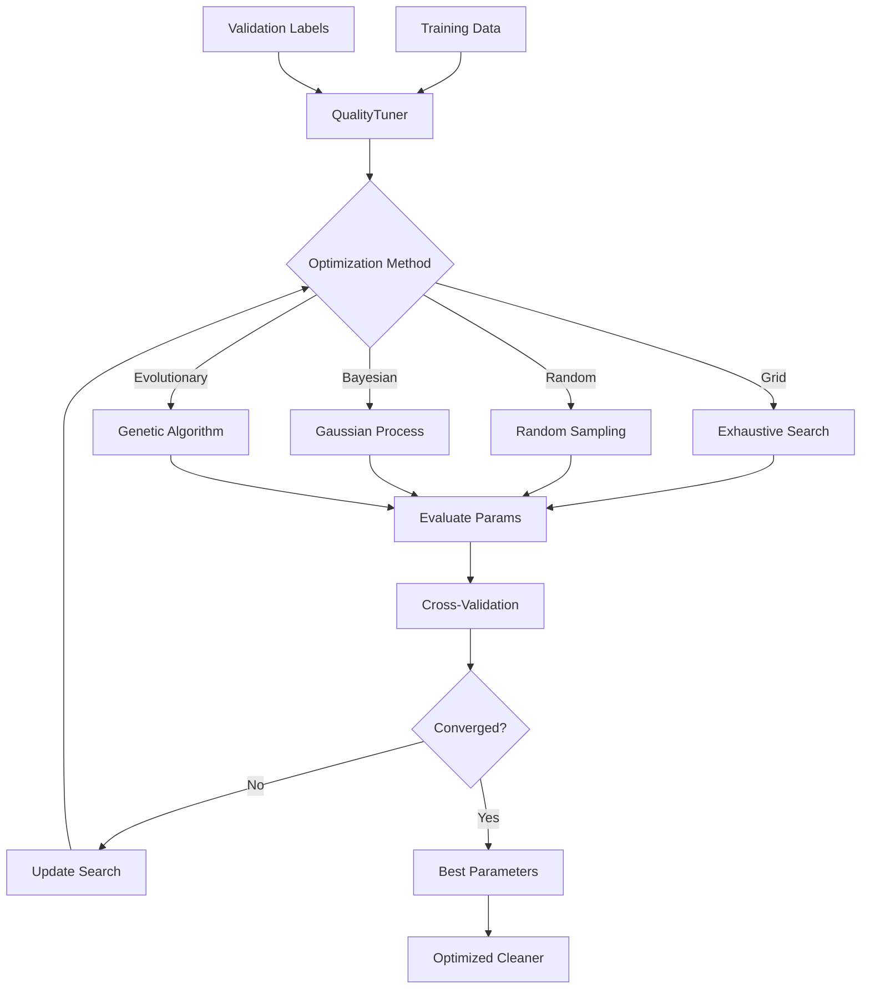

### 3. Cloud Service Architecture

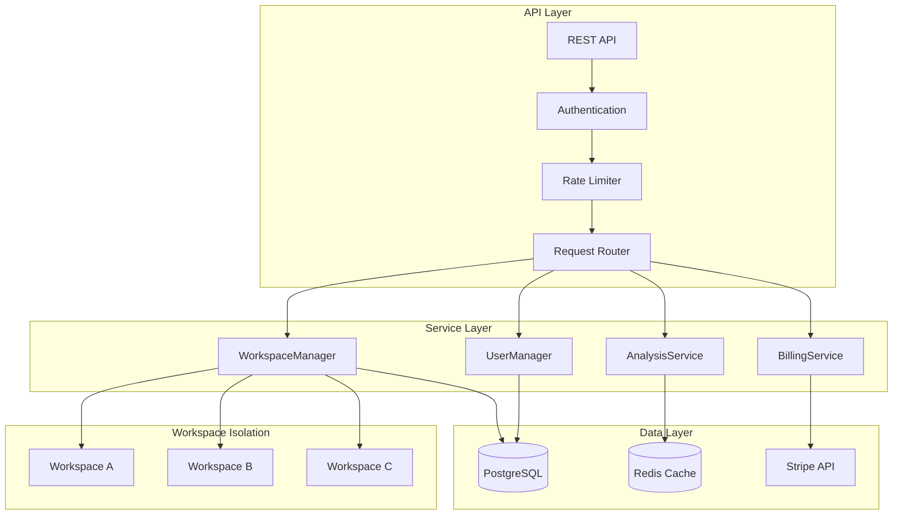

### 4. Privacy Pipeline

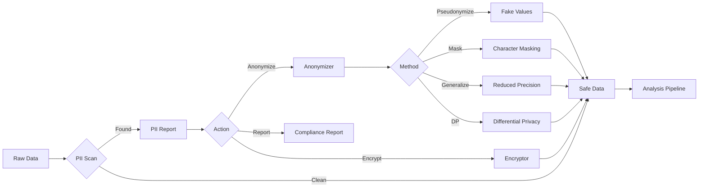

### 5. Collaborative Review Flow

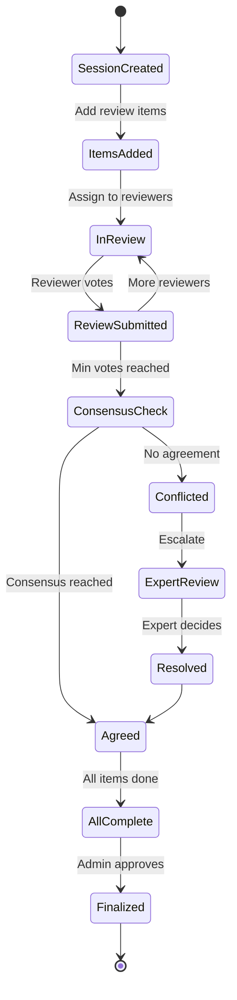

## Data Flow Patterns

### End-to-End Quality Pipeline

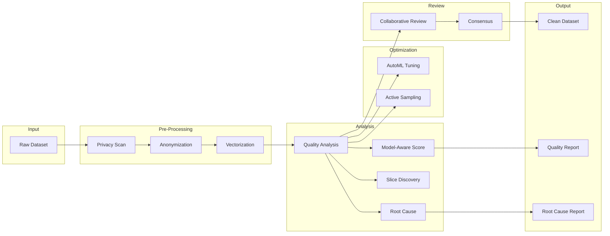

### Streaming Quality Monitoring

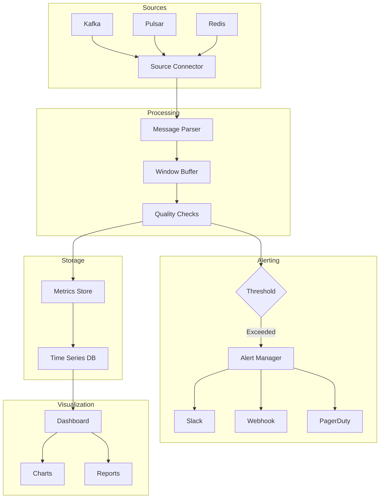

## Module Dependencies

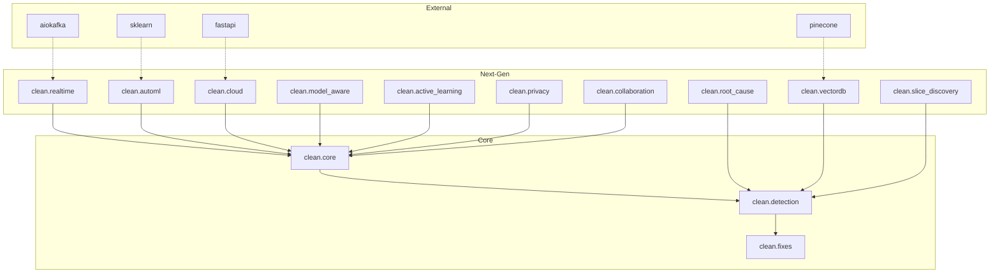

## Scalability Patterns

### Horizontal Scaling

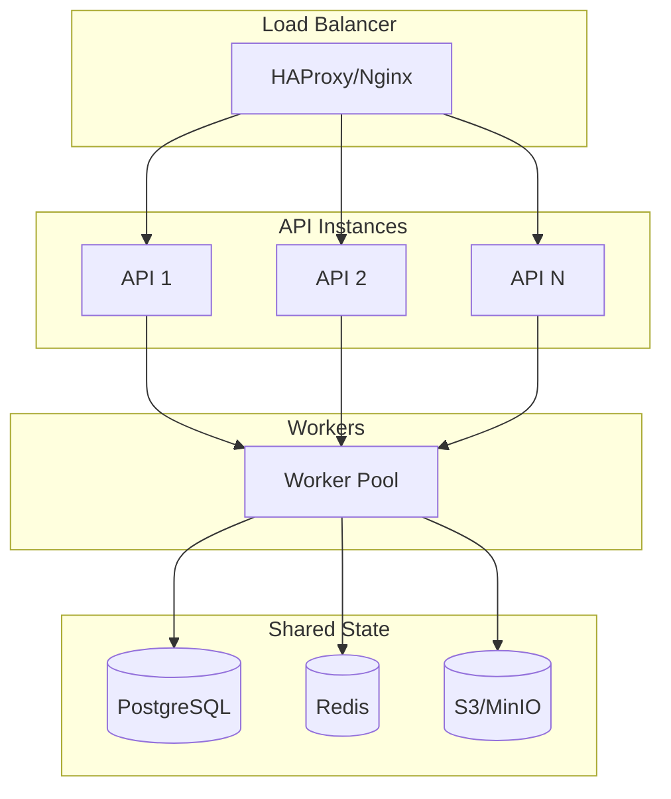

### Batch Processing

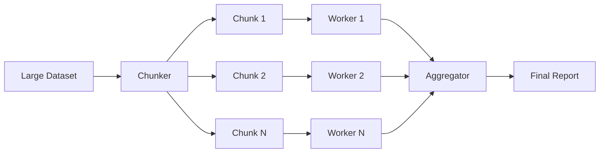

## Integration Points

| Feature | REST API | WebSocket | CLI | Python |
|---------|----------|-----------|-----|--------|
| Real-Time Pipeline | ✅ | ✅ | ✅ | ✅ |
| AutoML Tuning | ✅ | ❌ | ✅ | ✅ |
| Cloud Service | ✅ | ✅ | ✅ | ✅ |
| Root Cause | ✅ | ❌ | ❌ | ✅ |
| Vector DB | ✅ | ❌ | ❌ | ✅ |
| Model-Aware | ✅ | ❌ | ❌ | ✅ |
| Intelligent Sampling | ✅ | ❌ | ✅ | ✅ |
| Slice Discovery | ✅ | ❌ | ❌ | ✅ |
| Privacy Vault | ✅ | ❌ | ✅ | ✅ |
| Collaboration | ✅ | ✅ | ❌ | ✅ |

## Performance Considerations

### Memory Usage

| Feature | Memory Profile | Recommendation |
|---------|---------------|----------------|
| Real-Time Pipeline | Low (streaming) | Use for large datasets |
| AutoML Tuning | Medium (CV folds) | Reduce CV folds for large data |
| Vector DB | Low (external storage) | Use for >100K samples |
| Slice Discovery | High (clustering) | Sample for >1M samples |
| Collaboration | Low (external DB) | Use for any size |

### Compute Requirements

| Feature | CPU | GPU | Parallel |
|---------|-----|-----|----------|
| Real-Time Pipeline | Low | ❌ | ✅ |
| AutoML Tuning | High | Optional | ✅ |
| Root Cause | Medium | ❌ | ✅ |
| Vector DB | Low | ❌ | N/A |
| Slice Discovery | High | Optional | ✅ |
| Privacy (NER) | Medium | Optional | ✅ |
