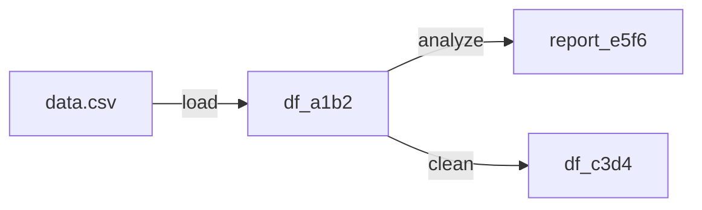

# LineageTracker

Track data transformations for reproducibility and auditing.

```python
from clean.lineage import LineageTracker
```

## Overview

`LineageTracker` records every operation performed on your data, enabling:
- Full audit trail of transformations
- Reproducible pipelines
- Debugging data issues
- Compliance documentation

## Constructor

```python
LineageTracker(
    name: str = "default",
    persist: bool = False,
    persist_path: Optional[Path] = None,
)
```

### Parameters

| Parameter | Type | Default | Description |
|-----------|------|---------|-------------|
| `name` | str | "default" | Pipeline name |
| `persist` | bool | False | Save lineage to disk |
| `persist_path` | Path | None | Save location |

## Methods

### record()

Record an operation.

```python
record(
    operation: str,
    input_hash: str,
    output_hash: str,
    parameters: Optional[Dict] = None,
    metadata: Optional[Dict] = None,
) -> str  # Returns operation ID
```

### get_history()

Get operation history.

```python
get_history(
    limit: Optional[int] = None,
) -> List[LineageEntry]
```

### get_provenance()

Get full provenance chain for a data hash.

```python
get_provenance(data_hash: str) -> List[LineageEntry]
```

### export()

Export lineage graph.

```python
export(
    format: str = "json",
    output_path: Optional[str] = None,
) -> Union[str, Dict]
```

## LineageEntry

```python
@dataclass
class LineageEntry:
    operation_id: str
    operation: str
    input_hash: str
    output_hash: str
    parameters: Dict[str, Any]
    metadata: Dict[str, Any]
    timestamp: datetime
    duration_ms: Optional[int]
```

## Example: Basic Tracking

```python
import pandas as pd
from clean import DatasetCleaner
from clean.lineage import LineageTracker

# Initialize tracker
tracker = LineageTracker(name="training-pipeline")

# Load data
df = pd.read_csv("data.csv")
tracker.record(
    operation="load",
    input_hash="file:data.csv",
    output_hash=tracker.hash_dataframe(df),
    parameters={"path": "data.csv"},
)

# Analyze
cleaner = DatasetCleaner(df, labels="label")
report = cleaner.analyze()
tracker.record(
    operation="analyze",
    input_hash=tracker.hash_dataframe(df),
    output_hash=tracker.hash_report(report),
    parameters={"detectors": "all"},
)

# Get clean data
clean_df = cleaner.get_clean_data(remove_duplicates=True)
tracker.record(
    operation="clean",
    input_hash=tracker.hash_dataframe(df),
    output_hash=tracker.hash_dataframe(clean_df),
    parameters={"remove_duplicates": True},
)

# View history
for entry in tracker.get_history():
    print(f"{entry.operation}: {entry.input_hash[:8]} → {entry.output_hash[:8]}")
```

## Example: With DatasetCleaner

```python
from clean import DatasetCleaner
from clean.lineage import LineageTracker

tracker = LineageTracker(name="my-pipeline")

# DatasetCleaner integrates with tracker
cleaner = DatasetCleaner(
    df,
    labels="label",
    lineage_tracker=tracker,  # Pass tracker
)

# All operations are automatically recorded
report = cleaner.analyze()
clean_df = cleaner.get_clean_data()

# View what happened
print(tracker.export(format="text"))
```

## Example: Persistent Lineage

```python
from pathlib import Path
from clean.lineage import LineageTracker

# Create persistent tracker
tracker = LineageTracker(
    name="production-pipeline",
    persist=True,
    persist_path=Path("./lineage/"),
)

# Operations are saved automatically
tracker.record(
    operation="transform",
    input_hash="abc123",
    output_hash="def456",
    parameters={"method": "normalize"},
)

# Later: reload lineage
tracker2 = LineageTracker.load(Path("./lineage/production-pipeline.json"))
history = tracker2.get_history()
```

## Export Formats

### JSON

```python
lineage_json = tracker.export(format="json")
```

```json
{
  "name": "training-pipeline",
  "created": "2024-01-15T10:00:00",
  "entries": [
    {
      "operation_id": "op_001",
      "operation": "load",
      "input_hash": "file:data.csv",
      "output_hash": "df_a1b2c3d4",
      "parameters": {"path": "data.csv"},
      "timestamp": "2024-01-15T10:00:01"
    }
  ]
}
```

### Mermaid Diagram

```python
mermaid = tracker.export(format="mermaid")
print(mermaid)
```



### Text

```python
text = tracker.export(format="text")
```

```
Pipeline: training-pipeline
Created: 2024-01-15T10:00:00

Operations:
1. load: file:data.csv → df_a1b2c3d4
   Parameters: path=data.csv
   
2. analyze: df_a1b2c3d4 → report_e5f6g7h8
   Parameters: detectors=all
   
3. clean: df_a1b2c3d4 → df_c3d4e5f6
   Parameters: remove_duplicates=True
```

## Provenance Query

Find how a dataset was created:

```python
# Get provenance for a specific output
provenance = tracker.get_provenance("df_c3d4e5f6")

for entry in provenance:
    print(f"{entry.operation}: {entry.parameters}")
```

Output:
```
clean: {'remove_duplicates': True}
load: {'path': 'data.csv'}
```

## Hash Utilities

```python
from clean.lineage import LineageTracker

# Hash a DataFrame
df_hash = LineageTracker.hash_dataframe(df)

# Hash a file
file_hash = LineageTracker.hash_file("data.csv")

# Hash arbitrary data
data_hash = LineageTracker.hash_data({"key": "value"})
```

## Use Cases

### Compliance Auditing

```python
# Generate audit report
audit = tracker.export(format="json", output_path="audit.json")

# Include in documentation
print(f"Data processed through {len(tracker.get_history())} operations")
print(f"Final data hash: {final_hash}")
```

### Debugging

```python
# Find when an issue was introduced
for entry in tracker.get_history():
    if "suspicious_operation" in entry.operation:
        print(f"Check operation at {entry.timestamp}")
        print(f"Parameters: {entry.parameters}")
```

### Reproducibility

```python
# Replay pipeline
lineage = LineageTracker.load("pipeline.json")

for entry in lineage.get_history():
    print(f"Replay: {entry.operation}")
    # Re-execute with same parameters
```
