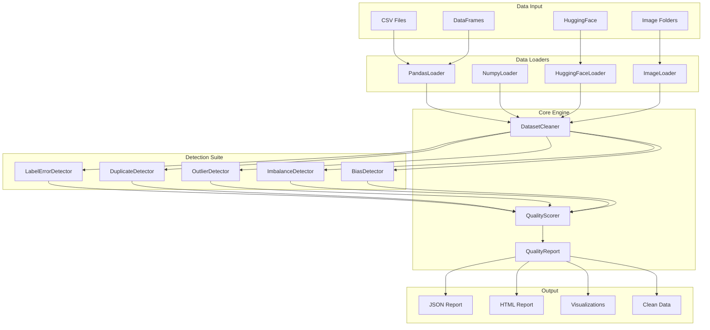
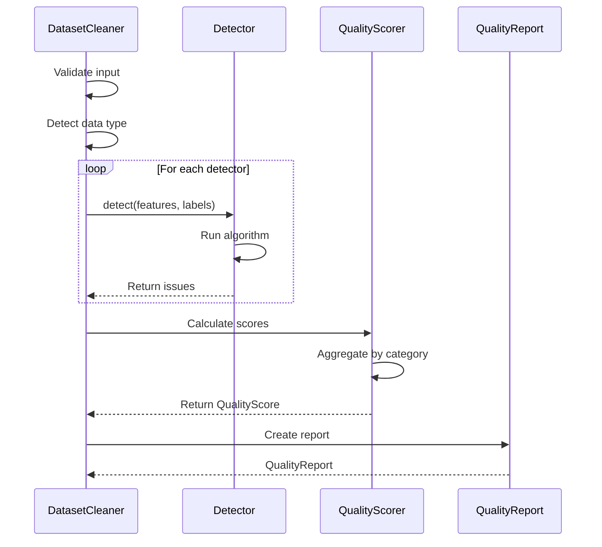
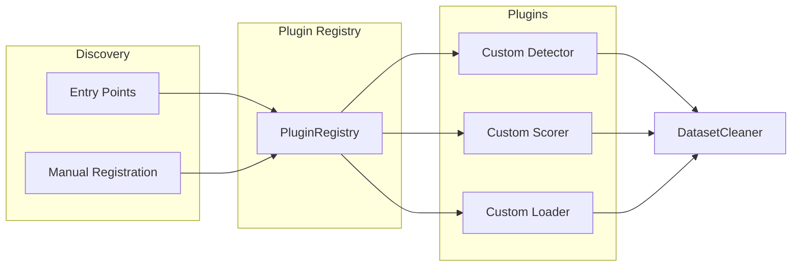
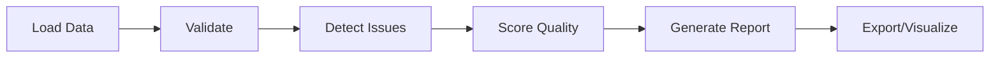
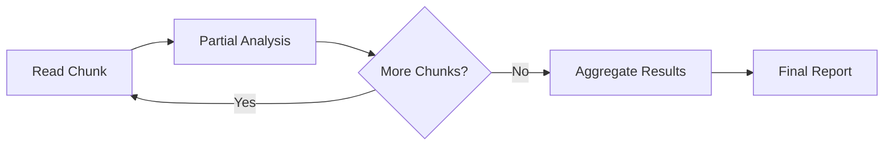
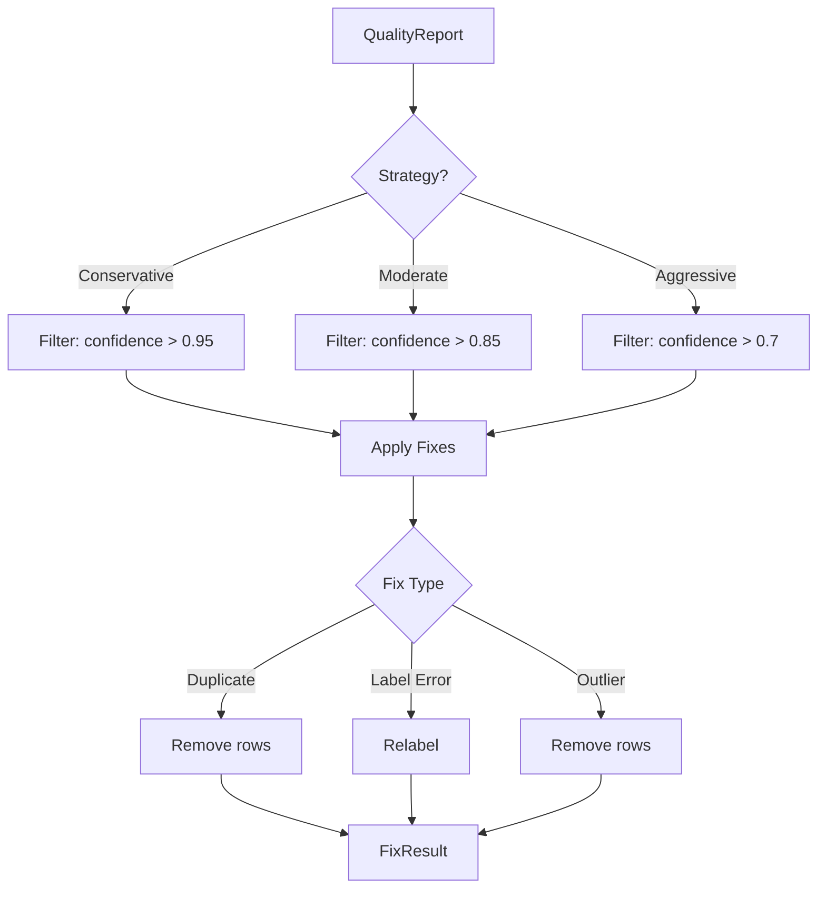
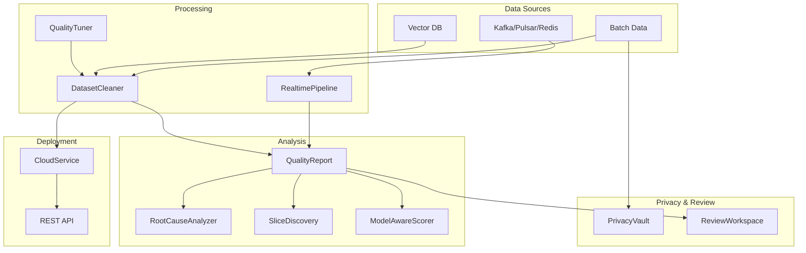

# Architecture

How Clean is designed and how components interact.

## High-Level Overview



## Component Details

### Data Loaders

Loaders normalize different data sources into a common format:

```python
# All loaders implement this interface
class BaseLoader(ABC):
    @abstractmethod
    def load(self) -> Tuple[np.ndarray, np.ndarray]:
        """Return (features, labels)"""
        pass
    
    @property
    @abstractmethod
    def data_type(self) -> str:
        """Return 'tabular', 'text', or 'image'"""
        pass
```

Auto-detection logic:
1. If input is `pd.DataFrame` → `PandasLoader`
2. If input is `np.ndarray` → `NumpyLoader`
3. If input is `str`/`Path` ending in `.csv` → `CSVLoader`
4. If input is HuggingFace `Dataset` → `HuggingFaceLoader`
5. If input is directory path → `ImageFolderLoader`

### Detection Pipeline



### Quality Scoring

Scores are calculated as:

```
overall_score = 100 - penalties

penalties:
  - label_errors: count / total * 100 * weight
  - duplicates: pairs / total * 100 * weight  
  - outliers: count / total * 100 * weight
  - imbalance: max(0, ratio - threshold) * weight
```

Default weights:
| Issue Type | Weight |
|------------|--------|
| Label Errors | 1.0 |
| Duplicates | 0.5 |
| Outliers | 0.3 |
| Imbalance | 0.2 |

### Plugin System



Plugins are discovered via:
1. **Entry points** in `pyproject.toml`
2. **Manual registration** via `PluginRegistry.register()`

## Data Flow

### Batch Analysis



### Streaming Analysis



### Fix Engine



## Key Design Decisions

### 1. Lazy Evaluation

Detection algorithms only run when `analyze()` is called, not during initialization.

### 2. Composable Detectors

Each detector is independent and can be run separately:

```python
from clean.detection import LabelErrorDetector

detector = LabelErrorDetector()
errors = detector.detect(X, y)
```

### 3. Immutable Reports

`QualityReport` is immutable after creation. Modifications create new instances.

### 4. Optional Dependencies

Heavy dependencies (torch, transformers) are optional:

```python
try:
    from sentence_transformers import SentenceTransformer
    HAS_SENTENCE_TRANSFORMERS = True
except ImportError:
    HAS_SENTENCE_TRANSFORMERS = False
```

### 5. Type Safety

Full type hints throughout:

```python
def analyze(
    self,
    detectors: Optional[List[str]] = None,
    show_progress: bool = True,
) -> QualityReport:
```

## Directory Structure

```
src/clean/
├── __init__.py          # Public API exports
├── core/
│   ├── cleaner.py       # DatasetCleaner
│   ├── report.py        # QualityReport
│   └── types.py         # Enums, dataclasses
├── detection/
│   ├── base.py          # BaseDetector
│   ├── label_errors.py
│   ├── duplicates.py
│   ├── outliers.py
│   ├── imbalance.py
│   └── bias.py
├── loaders/
│   ├── base.py          # BaseLoader
│   ├── pandas_loader.py
│   ├── numpy_loader.py
│   ├── csv_loader.py
│   ├── huggingface_loader.py
│   └── image_loader.py
├── scoring/
│   ├── quality_scorer.py
│   └── metrics.py
├── fix/
│   └── engine.py        # FixEngine
├── streaming/
│   └── cleaner.py       # StreamingCleaner
├── llm/
│   └── cleaner.py       # LLMDataCleaner
├── lineage/
│   └── tracker.py       # LineageTracker
├── plugins/
│   └── registry.py      # PluginRegistry
├── visualization/
│   ├── plots.py
│   └── interactive.py
├── utils/
│   ├── validation.py
│   └── export.py
│
# Enterprise modules
├── realtime.py          # Real-time streaming pipeline
├── automl.py            # AutoML threshold tuning
├── cloud.py             # Multi-tenant SaaS
├── root_cause.py        # Root cause analysis
├── vectordb.py          # Vector DB connectors
├── model_aware.py       # Model-aware scoring
├── slice_discovery.py   # Data slice discovery
├── privacy.py           # PII detection & anonymization
└── collaboration.py     # Collaborative review
```

## Enterprise Architecture



## Extension Points

| Extension | How to Extend |
|-----------|---------------|
| New detector | Extend `BaseDetector`, register with `PluginRegistry` |
| New loader | Extend `BaseLoader`, register with `PluginRegistry` |
| New scorer | Extend `BaseScorer`, register with `PluginRegistry` |
| New export format | Extend `QualityReport.export()` |
| New vector backend | Extend `VectorDBConnector` |
| New stream source | Extend `StreamSource` |
