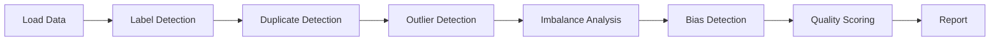

# Core Concepts

Understanding how Clean thinks about data quality will help you get the most from the library.

## The Data Quality Model

Clean analyzes five dimensions of data quality:

```
┌─────────────────────────────────────────────────────────────┐
│                     Data Quality Score                       │
├─────────────┬─────────────┬─────────────┬──────────────────┤
│   Labels    │  Uniqueness │  Distribution │    Fairness    │
│             │             │               │                │
│ • Errors    │ • Duplicates│ • Outliers    │ • Bias         │
│ • Noise     │ • Near-dups │ • Imbalance   │ • Parity       │
└─────────────┴─────────────┴───────────────┴────────────────┘
```

Each dimension is scored independently, then combined into an overall quality score.

## Detection Pipeline

When you call `cleaner.analyze()`, Clean runs this pipeline:



Each detector:
1. Fits on your data
2. Identifies problematic samples
3. Returns indices and metadata
4. Contributes to the overall score

## Quality Score

The quality score ranges from 0-100:

| Score | Interpretation |
|-------|----------------|
| 90-100 | Excellent - minimal issues |
| 80-89 | Good - some issues to review |
| 70-79 | Fair - significant issues |
| 60-69 | Poor - many issues |
| Below 60 | Critical - major data problems |

The score is calculated as:

```
score = 100 - Σ(issue_count × severity_weight)
```

Severity weights:
- Label errors: **High** (most impactful)
- Duplicates: **Medium**
- Outliers: **Low to Medium** (context-dependent)
- Imbalance: **Medium**
- Bias: **High** (can cause harm)

## Issue Types

### Label Errors

Samples where the assigned label is likely incorrect. Clean uses **confident learning** to identify these:

1. Train a classifier with cross-validation
2. Get predicted probabilities for each sample
3. Compare predictions to given labels
4. Flag samples where model confidently disagrees

[Learn more about Label Errors →](/docs/concepts/label-errors)

### Duplicates

Two types of duplicates:
- **Exact duplicates**: Identical rows (hash-based)
- **Near-duplicates**: Semantically similar (embedding-based)

Both cause:
- Inflated metrics (especially if in train and test)
- Wasted compute on redundant samples
- Data leakage if split across train/test

[Learn more about Duplicates →](/docs/concepts/duplicates)

### Outliers

Samples that are statistically unusual:
- **Global outliers**: Anomalous compared to entire dataset
- **Contextual outliers**: Anomalous for their class

Detection methods:
- Isolation Forest
- Local Outlier Factor (LOF)
- IQR (Interquartile Range)
- Z-score

[Learn more about Outliers →](/docs/concepts/outliers)

### Class Imbalance

Uneven distribution of classes:
- Causes models to ignore minority classes
- Leads to biased predictions
- Inflates accuracy metrics

[Learn more about Imbalance →](/docs/concepts/imbalance)

### Bias

Systematic unfairness in data:
- **Demographic parity**: Equal outcomes across groups
- **Equalized odds**: Equal error rates across groups
- **Proxy variables**: Features that encode protected attributes

[Learn more about Bias →](/docs/concepts/bias)

## Reports and Results

The `QualityReport` object contains:

```python
report.quality_score        # Overall score (0-100)
report.label_errors()       # DataFrame of label issues
report.duplicates()         # List of duplicate pairs
report.outliers()           # Array of outlier indices
report.imbalance_result     # Class distribution stats
report.bias_result          # Fairness metrics
```

Each result includes:
- **Indices** of affected samples
- **Confidence scores** for prioritization
- **Metadata** for understanding the issue

## Configuration

Customize detection with parameters:

```python
cleaner = DatasetCleaner(
    data=df,
    label_column='label',
    task='classification',      # or 'regression'
    feature_columns=['a', 'b'], # Subset of features
    exclude_columns=['id'],     # Columns to ignore
)

# Or configure individual detectors
from clean.detection import LabelErrorDetector

detector = LabelErrorDetector(
    cv_n_folds=5,
    prune_method='prune_by_noise_rate',
    confident_joint_method='count',
)
```

## Next Steps

Dive deeper into each detection type:

1. [Label Errors](/docs/concepts/label-errors) - How confident learning works
2. [Duplicates](/docs/concepts/duplicates) - Exact vs semantic matching
3. [Outliers](/docs/concepts/outliers) - Detection methods compared
4. [Imbalance](/docs/concepts/imbalance) - When imbalance matters
5. [Bias](/docs/concepts/bias) - Fairness metrics explained
